# TRƯỜNG ĐẠI HỌC PHENIKAA
## TRƯỜNG CÔNG NGHỆ THÔNG TIN PHENIKAA

***

<br>
<br>

<h1 align="center">BÁO CÁO ĐỒ ÁN LIÊN NGÀNH</h1>
<h2 align="center">CLOTHINGSTORE - NỀN TẢNG THƯƠNG MẠI ĐIỆN TỬ THỜI TRANG TÍCH HỢP TRÍ TUỆ NHÂN TẠO</h2>

<br>
<br>
<br>

**Sinh viên thực hiện:**
- **Phùng Thị Hạ Lam** - Mã sinh viên: **23010842**
- **Nguyễn Nhật Minh** - Mã sinh viên: **23010000**

**Giảng viên Hướng Dẫn:**
- **TS. Đặng Thị Thúy An**

<br>
<br>
<br>
<h3 align="center">Hà Nội, ngày 06 tháng 06 năm 2026</h3>

***

# MỤC LỤC

1. [CHƯƠNG 1. TỔNG QUAN ĐỀ TÀI](#_Toc231076795)
   - [1.1. Đặt vấn đề](#_Toc231076796)
   - [1.2. Khảo sát hiện trạng](#_Toc231076797)
   - [1.3. Bài toán đặt ra](#_Toc231076798)
   - [1.4. Giải pháp đề xuất](#_Toc231076799)
   - [1.5. Mục tiêu của đề tài](#_Toc231076800)
   - [1.6. Phạm vi nghiên cứu](#_Toc231076801)
   - [1.7. Công nghệ sử dụng](#_Toc231076802)
   - [1.8. Phương pháp thực hiện](#_Toc231076803)
   - [1.9. Kế hoạch thực hiện](#_Toc231076804)
   - [1.10. Ý nghĩa của đề tài](#_Toc231076805)
2. [CHƯƠNG 2. PHÂN TÍCH YÊU CẦU HỆ THỐNG](#_Toc231076806)
   - [2.1. Giới thiệu chương](#_Toc231076807)
   - [2.2. Phân tích tác nhân (Actor)](#_Toc231076808)
   - [2.3. Danh sách Use Case](#_Toc231076809)
   - [2.4. ĐẶC TẢ USE CASE](#_Toc231076810)
   - [2.5. Yêu cầu chức năng](#_Toc231076811)
   - [2.6. Yêu cầu phi chức năng](#_Toc231076812)
3. [CHƯƠNG 3. THIẾT KẾ HỆ THỐNG](#_Toc231076813)
   - [3.1. Giới thiệu chương](#_Toc231076814)
   - [3.2. Thiết kế kiến trúc tổng thể](#_Toc231076815)
   - [3.3. Thiết kế kiến trúc phần mềm](#_Toc231076816)
   - [3.4. Thiết kế cơ sở dữ liệu](#_Toc231076817)
   - [3.5. Thiết kế lớp (Class Diagram)](#_Toc231076818)
   - [3.6. Thiết kế luồng nghiệp vụ](#_Toc231076819)
   - [3.7. Thiết kế AI Chatbot](#_Toc231076820)
   - [3.8. Thiết kế Virtual Try-On](#_Toc231076821)
   - [3.9. Thiết kế bảo mật hệ thống](#_Toc231076822)
   - [3.10. Thiết kế tối ưu hiệu năng](#_Toc231076823)
4. [CHƯƠNG 4. TRIỂN KHAI HỆ THỐNG](#_Toc231076824)
   - [4.1. Giới thiệu chương](#_Toc231076825)
   - [4.2. Môi trường triển khai](#_Toc231076826)
   - [4.3. Cấu trúc source code](#_Toc231076827)
   - [4.4. Triển khai cơ sở dữ liệu](#_Toc231076828)
   - [4.5. Triển khai chức năng xác thực người dùng](#_Toc231076829)
   - [4.6. Triển khai quản lý sản phẩm](#_Toc231076830)
   - [4.7. Triển khai giỏ hàng và đặt hàng](#_Toc231076831)
   - [4.8. Triển khai Wishlist và đánh giá sản phẩm](#_Toc231076832)
   - [4.9. Triển khai AI Chatbot](#_Toc231076833)
   - [4.10. Triển khai Virtual Try-On](#_Toc231076834)
   - [4.11. Triển khai trang quản trị](#_Toc231076835)
   - [4.12. Kết quả đạt được](#_Toc231076836)
   - [4.13. Kết luận chương](#_Toc231076837)
5. [CHƯƠNG 5. KIỂM THỬ VÀ ĐÁNH GIÁ HỆ THỐNG](#_Toc231076838)
   - [5.1. Giới thiệu chương](#_Toc231076839)
   - [5.2. Mục tiêu kiểm thử](#_Toc231076840)
   - [5.3. Môi trường kiểm thử](#_Toc231076841)
   - [5.4. Phương pháp kiểm thử](#_Toc231076842)
   - [5.5. Kiểm thử chức năng người dùng](#_Toc231076843)
   - [5.6. Kiểm thử chức năng quản trị](#_Toc231076844)
   - [5.7. Kiểm thử AI Chatbot](#_Toc231076845)
   - [5.8. Kiểm thử Virtual Try-On](#_Toc231076846)
   - [5.9. Kiểm thử bảo mật](#_Toc231076847)
   - [5.10. Đánh giá hệ thống](#_Toc231076848)
6. [PHÂN CÔNG NHIỆM VỤ](#_Toc231076849)
7. [DANH MỤC HÌNH ẢNH](#_Toc231076793)
8. [DANH MỤC BẢNG BIỂU](#_Toc231076794)

***

# DANH MỤC HÌNH ẢNH

- **Hình 2.1**: Biểu đồ Use Case tổng thể hệ thống
- **Hình 3.1**: Sơ đồ kiến trúc tổng thể hệ thống
- **Hình 3.2**: Sơ đồ ERD cơ sở dữ liệu
- **Hình 3.3**: Sơ đồ lớp (Class Diagram) tổng thể hệ thống
- **Hình 3.4**: Sơ đồ lớp (Class Diagram) nhóm người dùng
- **Hình 3.5**: Sơ đồ lớp (Class Diagram) nhóm sản phẩm
- **Hình 3.6**: Sơ đồ lớp (Class Diagram) nhóm đơn hàng
- **Hình 3.7**: Sơ đồ tuần tự chức năng Đăng nhập
- **Hình 3.8**: Sơ đồ tuần tự chức năng Thêm giỏ hàng
- **Hình 3.9**: Sơ đồ tuần tự chức năng Đặt hàng (Checkout)
- **Hình 3.10**: Sơ đồ tuần tự chức năng AI Chatbot
- **Hình 3.11**: Sơ đồ tuần tự chức năng Virtual Try-On
- **Hình 3.12**: Sơ đồ cấu trúc kiến trúc AI Chatbot
- **Hình 3.13**: Sơ đồ cấu trúc kiến trúc Virtual Try-On
- **Hình 3.14**: Sơ đồ kiến trúc bảo mật hệ thống

***

# DANH MỤC BẢNG BIỂU

- **Bảng 1.1**: Kế hoạch thực hiện đề tài theo tuần hoặc Sprint
- **Bảng 4.1**: Cấu hình máy phát triển
- **Bảng 4.2**: Công cụ phát triển
- **Bảng 4.4.1**: Các cột trong bảng users lưu thông tin người dùng
- **Bảng 4.4.2**: Các cột trong bảng products lưu thông tin sản phẩm
- **Bảng 4.4.3**: Các cột trong bảng orders lưu đơn hàng của khách hàng
- **Bảng 4.12**: Tổng hợp kết quả sau quá trình triển khai
- **Bảng 5.1**: Môi trường kiểm thử
- **Bảng 5.2**: Kết quả kiểm thử chức năng Đăng ký
- **Bảng 5.3**: Kết quả kiểm thử chức năng Đăng nhập
- **Bảng 5.4**: Kết quả kiểm thử chức năng hiển thị và tìm kiếm sản phẩm
- **Bảng 5.5**: Kết quả kiểm thử chức năng giỏ hàng
- **Bảng 5.6**: Kết quả kiểm thử chức năng đặt hàng
- **Bảng 5.7**: Kết quả kiểm thử quản lý sản phẩm dành cho Admin
- **Bảng 5.8**: Kết quả kiểm thử quản lý đơn hàng dành cho Admin
- **Bảng 5.9**: Kết quả kiểm thử quản lý người dùng dành cho Admin
- **Bảng 5.10**: Kết quả đánh giá chất lượng phản hồi của AI Chatbot
- **Bảng 5.11**: Kết quả kiểm thử chức năng upload ảnh người dùng trong Virtual Try-On
- **Bảng 5.12**: Tổng hợp tỷ lệ kiểm thử thành công các module hệ thống

***

<a name="_Toc231076795"></a>
# CHƯƠNG 1. TỔNG QUAN ĐỀ TÀI

<a name="_Toc231076796"></a>
## 1.1. Đặt vấn đề

Trong những năm gần đây, cùng với sự phát triển mạnh mẽ của Internet và công nghệ số, thương mại điện tử đã trở thành một trong những lĩnh vực phát triển nhanh nhất trên thế giới. Sự thay đổi trong thói quen tiêu dùng của khách hàng đã thúc đẩy các doanh nghiệp chuyển đổi từ mô hình kinh doanh truyền thống sang mô hình trực tuyến nhằm mở rộng thị trường, giảm chi phí vận hành và nâng cao trải nghiệm khách hàng.

Đặc biệt trong lĩnh vực thời trang, mua sắm trực tuyến ngày càng được ưa chuộng nhờ tính tiện lợi, đa dạng sản phẩm và khả năng tiếp cận dễ dàng. Người dùng có thể tìm kiếm, so sánh và đặt mua sản phẩm chỉ với vài thao tác trên máy tính hoặc điện thoại di động mà không cần đến trực tiếp cửa hàng.

Tuy nhiên, mua sắm thời trang trực tuyến vẫn tồn tại nhiều hạn chế. Khách hàng không thể trực tiếp thử sản phẩm trước khi mua nên thường gặp khó khăn trong việc đánh giá độ phù hợp về kiểu dáng, kích thước và màu sắc. Điều này dẫn đến tỷ lệ đổi trả hàng hóa cao, ảnh hưởng đến trải nghiệm khách hàng cũng như chi phí vận hành của doanh nghiệp.

Bên cạnh đó, các hệ thống hỗ trợ khách hàng hiện nay chủ yếu sử dụng chatbot theo kịch bản cố định hoặc tìm kiếm theo từ khóa truyền thống. Các phương pháp này chưa đủ khả năng hiểu nhu cầu thực tế của người dùng, dẫn đến việc tư vấn sản phẩm chưa thực sự hiệu quả.

Sự phát triển của trí tuệ nhân tạo (Artificial Intelligence – AI), đặc biệt là các mô hình ngôn ngữ lớn (Large Language Models – LLM) và công nghệ xử lý hình ảnh bằng Deep Learning, đã mở ra nhiều cơ hội mới trong việc nâng cao trải nghiệm mua sắm trực tuyến. Các công nghệ này cho phép xây dựng hệ thống tư vấn thông minh và hỗ trợ thử đồ ảo trước khi mua hàng.

Xuất phát từ những vấn đề trên, nhóm thực hiện đề tài: **"Xây dựng hệ thống thương mại điện tử thời trang tích hợp trí tuệ nhân tạo ClothingStore"** (thương hiệu **NOVA**) nhằm ứng dụng các công nghệ hiện đại vào lĩnh vực thương mại điện tử, góp phần nâng cao trải nghiệm người dùng và tăng hiệu quả hoạt động kinh doanh.

<a name="_Toc231076797"></a>
## 1.2. Khảo sát hiện trạng

### 1.2.1. Thực trạng thương mại điện tử thời trang
Hiện nay, các nền tảng thương mại điện tử lớn như Shopee, Lazada, Tiki hay các website bán thời trang chuyên biệt đã cung cấp đầy đủ các chức năng mua sắm trực tuyến cơ bản như: quản lý sản phẩm, giỏ hàng, thanh toán trực tuyến, theo dõi đơn hàng và đánh giá sản phẩm. Các hệ thống này giúp người dùng tiếp cận sản phẩm dễ dàng hơn so với phương thức mua sắm truyền thống.

### 1.2.2. Những hạn chế của các hệ thống hiện tại
Mặc dù đã đạt được nhiều thành công, các hệ thống thương mại điện tử hiện tại vẫn còn tồn tại một số hạn chế cốt lõi:
- Người dùng không thể thử quần áo trước khi mua, dẫn đến việc khó đánh giá độ phù hợp của sản phẩm với vóc dáng cơ thể.
- Chatbot hỗ trợ khách hàng đa số mang tính kịch bản cứng nhắc, không hiểu được ngôn ngữ tự nhiên phức tạp.
- Tìm kiếm sản phẩm chủ yếu dựa trên từ khóa khớp chính xác, chưa đủ thông minh để nhận diện ngữ nghĩa.
- Tỷ lệ đổi trả sản phẩm do không vừa kích cỡ hoặc không hợp kiểu dáng còn rất cao, gây tổn thất lớn về chi phí vận hành cho cả khách hàng và doanh nghiệp.

<a name="_Toc231076798"></a>
## 1.3. Bài toán đặt ra

Từ những hạn chế đã phân tích, bài toán đặt ra là xây dựng một hệ thống thương mại điện tử thời trang có khả năng:
1. Hỗ trợ khách hàng lựa chọn sản phẩm phù hợp và tư vấn sản phẩm bằng ngôn ngữ tự nhiên thông qua trí tuệ nhân tạo.
2. Cho phép khách hàng thử đồ ảo trực quan (Virtual Try-On) trước khi quyết định mua hàng.
3. Quản lý toàn bộ quy trình bán hàng trực tuyến một cách mượt mà trên cả nền tảng Web và ứng dụng Di động (Mobile App).
4. Đảm bảo hiệu năng hệ thống cao, bảo mật thông tin tối đa và có khả năng mở rộng trong tương lai.

<a name="_Toc231076799"></a>
## 1.4. Giải pháp đề xuất

Để giải quyết bài toán trên, nhóm đề xuất xây dựng hệ thống **ClothingStore** với các thành phần chính:
- **Hệ thống thương mại điện tử đa nền tảng**: Xây dựng Web App sử dụng Spring Boot kết hợp giao diện Thymeleaf, đồng thời cung cấp hệ thống RESTful API kết hợp mã bảo mật JWT để phục vụ cho ứng dụng di động Flutter.
- **AI Chatbot tư vấn thông minh**: Sử dụng mô hình ngôn ngữ lớn Google Gemini 2.5 Flash thông qua cơ chế Function Calling (gọi hàm tự động) để truy vấn trực tiếp vào cơ sở dữ liệu thật của cửa hàng, giải đáp thắc mắc và đề xuất sản phẩm theo yêu cầu về loại đồ, màu sắc, giá cả.
- **Virtual Try-On (Thử đồ ảo)**: Xây dựng dịch vụ FastAPI (Python) độc lập hỗ trợ xử lý ảnh thử đồ ảo. Tích hợp mô hình IDM-VTON trên nền tảng Cloud (thông qua Replicate API) và mô hình CatVTON chạy trực tiếp trên GPU máy chủ nội bộ làm cơ chế tự động chuyển đổi dự phòng (auto-fallback) khi cạn kiệt tài nguyên cloud.

<a name="_Toc231076800"></a>
## 1.5. Mục tiêu của đề tài

### 1.5.1. Mục tiêu tổng quát
Nghiên cứu và phát triển một nền tảng thương mại điện tử thời trang hoàn chỉnh, tích hợp các công nghệ trí tuệ nhân tạo tiên tiến như xử lý ngôn ngữ tự nhiên (Gemini API) và thử đồ ảo (CatVTON/IDM-VTON) nhằm cải thiện trải nghiệm mua sắm của khách hàng và tối ưu quy trình quản lý bán hàng.

### 1.5.2. Mục tiêu cụ thể
- Xây dựng hệ thống Backend bằng Spring Boot 3.5.x vững chắc, cấu trúc logic rõ ràng.
- Thiết kế cơ sở dữ liệu MySQL 8 tối ưu, chuẩn hóa dữ liệu cao.
- Triển khai giao diện Web bán hàng mượt mà bằng Thymeleaf & Tailwind CSS, tích hợp tiện ích Chatbot và Try-On Studio.
- Phát triển ứng dụng di động hoàn chỉnh bằng Flutter sử dụng Riverpod quản lý trạng thái.
- Tích hợp thành công AI Chatbot sử dụng Gemini API và Virtual Try-On sử dụng FastAPI Server.
- Đảm bảo các tiêu chuẩn bảo mật: mã hóa BCrypt, cơ chế chống tấn công brute-force đăng nhập, lọc tệp tải lên độc hại và các lớp chống tấn công CSRF, CORS.

<a name="_Toc231076801"></a>
## 1.6. Phạm vi nghiên cứu

### 1.6.1. Phạm vi chức năng
- **Đối với khách hàng**: Đăng ký, đăng nhập (Web & Di động), quản lý hồ sơ, xem danh mục, tìm kiếm autocomplete đầy đủ (MySQL Full-text), quản lý giỏ hàng, áp dụng mã giảm giá, đặt hàng (COD), hủy đơn hàng, gửi đánh giá đính kèm hình ảnh, lưu sản phẩm yêu thích (Wishlist), nhận thông báo thời gian thực (SSE), tham gia hệ thống giới thiệu (Referral System), thử đồ ảo (Try-On), và chat với trợ lý ảo.
- **Đối với quản trị viên (Admin)**: Quản trị thông qua giao diện Dashboard trực quan với các biểu đồ doanh thu theo thời gian, quản lý danh mục (Category/SubCategory), quản lý sản phẩm cùng hình ảnh (kéo-thả sắp xếp gallery) và thuộc tính (Variants), bật/tắt chức năng Try-On và tải lên ảnh quần áo mẫu đã tách nền, quản lý đơn hàng (cập nhật trạng thái), quản lý người dùng, quản lý mã giảm giá (Coupon), và xuất báo cáo thống kê định dạng Excel.

### 1.6.2. Phạm vi công nghệ
- **Backend Core**: Java 17, Spring Boot 3.5.14, Spring Security 6, Spring Data JPA, Hibernate 6, HikariCP, Caffeine Cache.
- **Web Frontend**: Thymeleaf, Tailwind CSS 3, Vanilla JS.
- **Mobile app**: Flutter 3.11+, Dart, Riverpod 2.6, GoRouter 14, Dio 5.
- **Database**: MySQL 8.
- **Dịch vụ AI & Xử lý ảnh**: FastAPI (Python 3.10), Google Gemini 2.5 Flash, Replicate IDM-VTON API, CatVTON, SegFormer (Human Parsing), rembg (tách nền tự động).

<a name="_Toc231076802"></a>
## 1.7. Công nghệ sử dụng

- **Spring Boot 3.5**: Cung cấp môi trường phát triển ứng dụng Backend mạnh mẽ, quản lý các kết nối database tối ưu, cơ chế Security phân tầng hiệu quả và các cơ chế xử lý bất đồng bộ (@Async) gửi Email SMTP, real-time SSE stream.
- **MySQL 8**: Hệ quản trị cơ sở dữ liệu quan hệ phổ biến, lưu trữ an toàn toàn bộ thông tin sản phẩm, đơn hàng, tài khoản người dùng, hỗ trợ lập chỉ mục Full-text Index tìm kiếm nhanh chóng.
- **Google Gemini API (Gemini 2.5 Flash)**: Cung cấp mô hình ngôn ngữ lớn thế hệ mới có tốc độ nhanh, hỗ trợ đắc lực tính năng Function Calling giúp chatbot tương tác thông minh với cơ sở dữ liệu của hệ thống.
- **FastAPI & Python**: Dùng để dựng server AI xử lý Try-On tách biệt với luồng xử lý Java nhằm tối ưu hóa tài nguyên phần cứng, hỗ trợ chạy các thư viện Machine Learning/Deep Learning.
- **Flutter**: Framework mã nguồn mở của Google giúp viết mã một lần và biên dịch trực tiếp sang ứng dụng di động native hiệu năng cao trên cả hai nền tảng Android và iOS.

<a name="_Toc231076803"></a>
## 1.8. Phương pháp thực hiện

Nhóm áp dụng quy trình phát triển phần mềm Agile/Scrum kết hợp các giai đoạn:
1. **Phân tích yêu cầu**: Khảo sát nghiệp vụ, thu thập thông tin, định nghĩa các Use Case và xây dựng cấu trúc cơ sở dữ liệu.
2. **Thiết kế**: Vẽ các sơ đồ UML (Use Case, Class Diagram, Sequence Diagram), thiết kế mô hình cơ sở dữ liệu (ERD) và thiết kế giao diện UI/UX (Web & Mobile).
3. **Phát triển**: Triển khai Backend Spring Boot song song với việc xây dựng Client Web và ứng dụng di động Flutter. Đồng thời, cấu hình và huấn luyện/triển khai các API AI (Gemini, FastAPI Try-On).
4. **Kiểm thử & Tích hợp**: Thực hiện viết các test case JUnit 5 cho Backend, kiểm thử hộp đen giao diện người dùng, đánh giá chất lượng mô hình AI và kiểm thử bảo mật.

<a name="_Toc231076804"></a>
## 1.9. Kế hoạch thực hiện

Kế hoạch phát triển dự án được chia làm 6 Sprint tương ứng với các giai đoạn:

| **Sprint** | **Nội dung công việc** | **Sản phẩm bàn giao** |
| :--- | :--- | :--- |
| **Sprint 1** | Phân tích yêu cầu và thiết kế kiến trúc | Tài liệu đặc tả, Sơ đồ ERD, Sơ đồ Use Case |
| **Sprint 2** | Thiết kế chi tiết & Khởi tạo cơ sở dữ liệu | Cấu trúc bảng MySQL, Sơ đồ Class và Sequence |
| **Sprint 3** | Xây dựng Backend Spring Boot & REST API | Mã nguồn Backend, Tài liệu API Swagger |
| **Sprint 4** | Phát triển Client Web (Thymeleaf) & Mobile App | Giao diện Web, Bản cài đặt thử nghiệm Flutter |
| **Sprint 5** | Tích hợp AI Chatbot và Virtual Try-On Server | Server FastAPI hoạt động, Tích hợp thành công AI vào client |
| **Sprint 6** | Kiểm thử, sửa lỗi và đóng gói sản phẩm | Unit tests, Bản báo cáo hoàn chỉnh, Hệ thống triển khai chạy thử |

**Bảng 1.1**: Kế hoạch thực hiện đề tài theo tuần hoặc Sprint

<a name="_Toc231076805"></a>
## 1.10. Ý nghĩa của đề tài

- **Ý nghĩa học thuật**: Giúp sinh viên nắm vững quy trình xây dựng ứng dụng phần mềm đa nền tảng lớn, thực tế; vận dụng lý thuyết hệ quản trị cơ sở dữ liệu, các mẫu thiết kế hướng đối tượng nâng cao, và kỹ năng tích hợp trí tuệ nhân tạo vào sản phẩm thực tiễn.
- **Ý nghĩa thực tiễn**: Đóng góp một giải pháp công nghệ thời trang (FashionTech) đột phá, giúp khách hàng mua sắm trực tuyến an tâm hơn, giảm thiểu tối đa tỷ lệ hoàn trả hàng, gia tăng tỷ lệ chuyển đổi đơn hàng và nâng tầm trải nghiệm của người dùng Việt.

***

<a name="_Toc231076806"></a>
# CHƯƠNG 2. PHÂN TÍCH YÊU CẦU HỆ THỐNG

<a name="_Toc231076807"></a>
## 2.1. Giới thiệu chương

Chương này tập trung trình bày kết quả phân tích yêu cầu của hệ thống ClothingStore. Nhóm tiến hành định vị các tác nhân (Actors) tham gia vào hệ thống, xây dựng biểu đồ Use Case tổng thể, đặc tả chi tiết các Use Case quan trọng và đưa ra danh sách các yêu cầu chức năng và phi chức năng nhằm định hướng chi tiết cho các bước thiết kế tiếp theo.

<a name="_Toc231076808"></a>
## 2.2. Phân tích tác nhân (Actor)

Hệ thống ClothingStore xác định hai nhóm tác nhân chính:

### 2.2.1. Khách hàng (Customer)
Là người trực tiếp truy cập vào hệ thống (Web hoặc Mobile App) để tìm kiếm, tham khảo, thử đồ ảo và đặt mua các sản phẩm thời trang. Tác nhân này đòi hỏi giao diện trực quan, tốc độ phản hồi nhanh và các tính năng hỗ trợ thông minh như Chatbot hay Try-On Studio.

Nhóm khách hàng được chia thành hai mức truy cập, có sự phân quyền rõ ràng (chi tiết ở [mục 3.9](#_Toc231076822)):
- **Khách vãng lai (Guest – chưa đăng nhập)**: duyệt/tìm sản phẩm, dùng giỏ hàng (lưu theo phiên), trò chuyện với Chatbot và thử đồ ảo. Trên **Web**, khách vãng lai vẫn có thể đặt hàng (COD) — đơn được tạo không gắn tài khoản. Trên **Mobile**, ứng dụng bắt buộc đăng nhập trước khi vào bước thanh toán.
- **Khách hàng có tài khoản (User – đã đăng nhập)**: kế thừa toàn bộ quyền của khách vãng lai, đồng thời được dùng các tính năng gắn với tài khoản: lịch sử đơn hàng, Wishlist, hồ sơ cá nhân, coupon cá nhân và đề xuất coupon khi thanh toán, viết đánh giá, nhận thông báo thời gian thực và tham gia chương trình giới thiệu (Referral).

### 2.2.2. Quản trị viên (Administrator)
Là nhân sự vận hành hệ thống, chịu trách nhiệm quản lý danh mục sản phẩm, biến thể, kiểm soát đơn hàng, phê duyệt hủy đơn, cấu hình các mã giảm giá, theo dõi báo cáo doanh thu thông qua trang quản trị Admin Dashboard và tương tác gửi thông báo cho khách hàng.

<a name="_Toc231076809"></a>
## 2.3. Danh sách Use Case

Dưới đây là sơ đồ Use Case tổng thể của hệ thống, minh họa các tương tác giữa khách hàng, quản trị viên và các module chức năng chính:

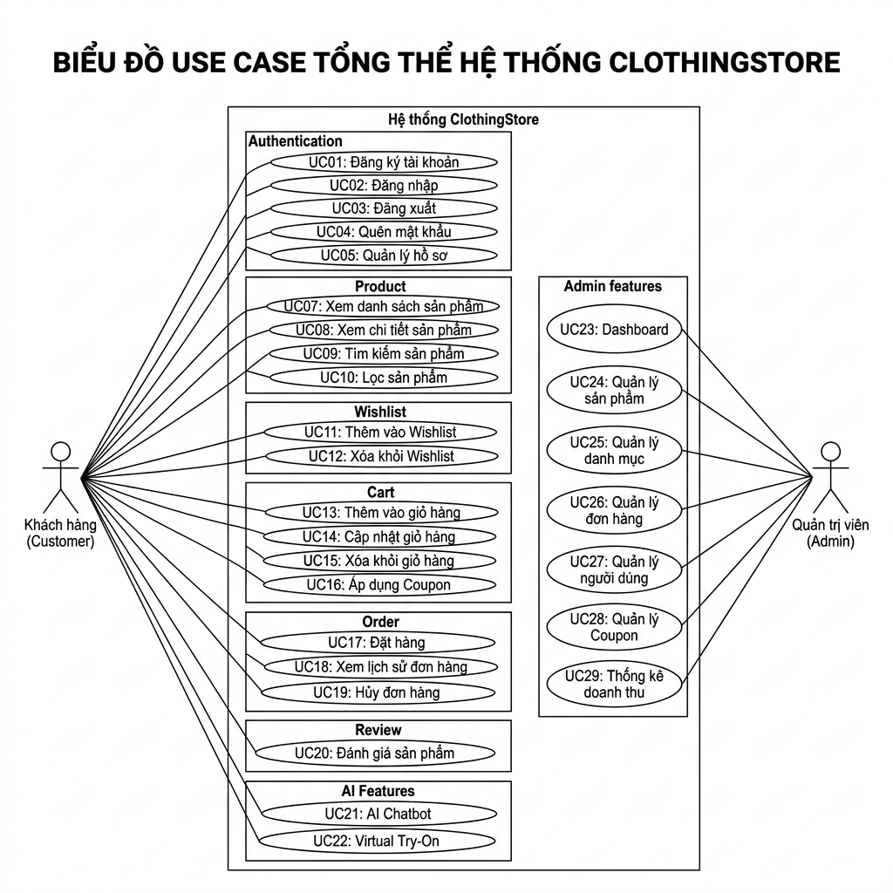

Hệ thống bao gồm các cụm chức năng:
- **Auth (Xác thực)**: Đăng ký, Đăng nhập, Đăng xuất, Quên mật khẩu, Quản lý hồ sơ.
- **Products (Sản phẩm)**: Xem danh sách, Chi tiết sản phẩm, Tìm kiếm gợi ý, Lọc sản phẩm.
- **Wishlist (Yêu thích)**: Thêm/Xóa sản phẩm khỏi danh sách yêu thích.
- **Cart & Order (Giỏ hàng & Đơn hàng)**: Thêm/Cập nhật/Xóa giỏ hàng, Áp dụng Coupon, Đặt hàng, Xem lịch sử đơn, Hủy đơn/Yêu cầu hủy đơn.
- **Reviews (Đánh giá)**: Viết đánh giá kèm hình ảnh sau khi nhận hàng.
- **AI Features**: Chat với AI chatbot tư vấn sản phẩm, Thử đồ ảo bằng Try-On.
- **Admin Features**: Xem Dashboard biểu đồ, CRUD sản phẩm/danh mục/người dùng/coupon, Cập nhật đơn hàng và gửi thông báo.

<a name="_Toc231076810"></a>
## 2.4. ĐẶC TẢ USE CASE

Dưới đây là tài liệu đặc tả chi tiết cho toàn bộ các Use Case của hệ thống ClothingStore:

### 2.4.1. UC01 – Đăng ký tài khoản
- **Mô tả**: Khách hàng tạo tài khoản mới trên hệ thống để mua sắm, tích hợp mã giới thiệu để nhận ưu đãi.
- **Tác nhân**: Khách hàng (Customer).
- **Tiền điều kiện**: Khách hàng chưa đăng nhập và chưa có tài khoản với email dự định đăng ký.
- **Hậu điều kiện**: Tài khoản mới được tạo, mật khẩu mã hóa BCrypt, sinh mã referral 16 ký tự và tự động đăng nhập.
- **Luồng chính**:
  1. Khách hàng nhấp vào link Đăng ký.
  2. Khách hàng điền thông tin: Họ tên, Email, Số điện thoại, Mật khẩu, Nhập lại mật khẩu, và Mã giới thiệu (nếu có).
  3. Hệ thống kiểm tra tính hợp lệ của định dạng email, độ dài mật khẩu (tối thiểu 6 ký tự).
  4. Hệ thống kiểm tra email xem đã được đăng ký trước đó chưa.
  5. Hệ thống mã hóa mật khẩu, tạo mã giới thiệu duy nhất cho người dùng mới, thiết lập người giới thiệu nếu mã referral hợp lệ.
  6. Lưu thông tin người dùng vào bảng `users` trong MySQL.
  7. Sinh mã JWT (cho Mobile) hoặc tạo Session (cho Web), phản hồi trạng thái đăng ký thành công.
- **Ngoại lệ**:
  - Email đã được sử dụng: Hệ thống báo lỗi "Email đã tồn tại".
  - Mật khẩu nhập lại không khớp: Hệ thống báo lỗi và yêu cầu nhập lại.
  - Mã giới thiệu không tồn tại: Hệ thống báo lỗi "Mã giới thiệu không hợp lệ".

### 2.4.2. UC02 – Đăng nhập
- **Mô tả**: Người dùng xác thực quyền truy cập vào hệ thống để mua sắm (User) hoặc quản trị (Admin).
- **Tác nhân**: Khách hàng (Customer), Quản trị viên (Administrator).
- **Tiền điều kiện**: Người dùng đã có tài khoản được kích hoạt trên hệ thống.
- **Hậu điều kiện**: Tạo Session (Web) hoặc trả về chuỗi JWT (Mobile), ghi nhận quyền hạn truy cập của người dùng.
- **Luồng chính**:
  1. Người dùng nhập Email và Mật khẩu tại giao diện đăng nhập.
  2. Bộ lọc `LoginRateLimitFilter` kiểm tra xem IP này có bị chặn do đăng nhập sai quá nhiều lần hay không.
  3. Hệ thống truy vấn thông tin tài khoản từ bảng `users` dựa vào Email.
  4. Hệ thống sử dụng `BCryptPasswordEncoder` để so khớp mật khẩu đã nhập và mật khẩu đã mã hóa trong database.
  5. Nếu khớp, hệ thống kiểm tra vai trò (Role):
     - Đối với Web: Thiết lập HttpSession (lưu trong MySQL thông qua Spring Session JDBC) và redirect về trang chủ (nếu là USER) hoặc trang quản trị `/admin` (nếu là ADMIN).
     - Đối với Mobile API: Sinh JWT token chứa payload thông tin email và vai trò, trả về định dạng JSON.
- **Ngoại lệ**:
  - Nhập sai mật khẩu hoặc email không tồn tại: Hệ thống báo lỗi "Sai tài khoản hoặc mật khẩu".
  - Đăng nhập sai quá 10 lần trong vòng 15 phút (theo IP): Hệ thống chặn tạm thời IP và trả mã HTTP 429, thông báo yêu cầu thử lại sau.

### 2.4.3. UC03 – Đăng xuất
- **Mô tả**: Người dùng kết thúc phiên làm việc hiện tại và hủy bỏ trạng thái xác thực.
- **Tác nhân**: Khách hàng (Customer), Quản trị viên (Administrator).
- **Tiền điều kiện**: Người dùng đang ở trạng thái đăng nhập.
- **Hậu điều kiện**: Phiên đăng nhập bị hủy bỏ hoàn toàn trên máy chủ và máy khách.
- **Luồng chính**:
  1. Người dùng bấm chọn "Đăng xuất" trên thanh điều hướng.
  2. Hệ thống tiếp nhận yêu cầu:
     - Đối với Web: Hủy HttpSession hiện tại trên máy chủ, xóa cookie `JSESSIONID` trên trình duyệt người dùng.
     - Đối với Mobile API: Client tự động xóa token JWT khỏi bộ nhớ cục bộ (Secure Storage).
  3. Hệ thống chuyển hướng người dùng về trang chủ của cửa hàng dưới quyền khách vãng lai (Guest).

### 2.4.4. UC04 – Quên mật khẩu
- **Mô tả**: Hỗ trợ người dùng lấy lại mật khẩu đăng nhập thông qua liên kết đặt lại gửi tới email cá nhân.
- **Tác nhân**: Khách hàng (Customer), Quản trị viên (Administrator).
- **Tiền điều kiện**: Người dùng không thể đăng nhập do quên mật khẩu.
- **Hậu điều kiện**: Một mã token reset được sinh ra và gửi qua email, cho phép đổi mật khẩu mới.
- **Luồng chính**:
  1. Người dùng bấm chọn "Quên mật khẩu" tại giao diện đăng nhập.
  2. Người dùng nhập Email đã đăng ký và bấm gửi.
  3. Hệ thống sinh ngẫu nhiên một mã token duy nhất, lưu vào bảng `password_reset_tokens` cùng thời hạn hết hạn (expiry date là 15 phút).
  4. Hệ thống kích hoạt dịch vụ `EmailService` gửi bất đồng bộ một email chứa đường link khôi phục mật khẩu có kèm token.
  5. Người dùng click vào đường link trong email, hệ thống hiển thị trang nhập mật khẩu mới.
  6. Người dùng nhập mật khẩu mới và xác nhận mật khẩu, hệ thống cập nhật mật khẩu đã mã hóa BCrypt vào database và xóa token reset.
- **Ngoại lệ**:
  - Để tránh rò rỉ dữ liệu (Email Harvesting), hệ thống luôn thông báo "Đã gửi liên kết khôi phục" kể cả khi email nhập vào không tồn tại trong hệ thống.
  - Token hết hạn hoặc không hợp lệ: Trang web hiển thị thông báo lỗi "Mã xác nhận đã hết hạn hoặc không hợp lệ".

### 2.4.5. UC05 – Quản lý hồ sơ cá nhân
- **Mô tả**: Cho phép người dùng xem và cập nhật thông tin liên lạc cá nhân hoặc đổi mật khẩu đăng nhập.
- **Tác nhân**: Khách hàng (Customer).
- **Tiền điều kiện**: Người dùng đã đăng nhập vào tài khoản của mình.
- **Hậu điều kiện**: Thông tin mới được lưu trữ cập nhật vào database.
- **Luồng chính**:
  1. Người dùng truy cập vào trang "Hồ sơ cá nhân".
  2. Hệ thống tải thông tin hiện tại từ database hiển thị lên form: Họ tên, Số điện thoại, Địa chỉ.
  3. Người dùng chỉnh sửa các thông tin và nhấn "Cập nhật".
  4. Hệ thống thực hiện kiểm tra định dạng số điện thoại, sau đó cập nhật thông tin vào bảng `users`.
  5. Nếu người dùng chọn đổi mật khẩu: Người dùng nhập mật khẩu cũ, mật khẩu mới và mật khẩu xác nhận. Hệ thống kiểm tra mật khẩu cũ có khớp với database không, mã hóa mật khẩu mới và lưu lại.
- **Ngoại lệ**: Mật khẩu cũ nhập sai hoặc mật khẩu mới nhập lại không khớp. Hệ thống báo lỗi và giữ nguyên form.

### 2.4.7. UC07 – Xem danh sách sản phẩm
- **Mô tả**: Cho phép người dùng duyệt qua tất cả sản phẩm đang bán của cửa hàng theo dạng lưới phân trang.
- **Tác nhân**: Khách hàng (Customer).
- **Tiền điều kiện**: Không có.
- **Hậu điều kiện**: Danh sách sản phẩm hiển thị đầy đủ hình ảnh, tên và giá bán tối thiểu.
- **Luồng chính**:
  1. Người dùng truy cập vào trang cửa hàng hoặc chọn một danh mục cụ thể.
  2. Hệ thống truy vấn danh sách sản phẩm hoạt động (`active=true`) thông qua `ProductRepository` kèm phân trang (mặc định 12 sản phẩm/trang).
  3. Hệ thống trả về danh sách sản phẩm gồm: Ảnh bìa (ảnh có `primaryImage=true` hoặc `sortOrder=0`), Tên sản phẩm, Slug và Giá tối thiểu (`minPrice`).
  4. Giao diện hiển thị danh sách cho người dùng lựa chọn.

### 2.4.8. UC08 – Xem chi tiết sản phẩm
- **Mô tả**: Hiển thị thông tin chi tiết của một sản phẩm cụ thể bao gồm hình ảnh, thuộc tính và các đánh giá.
- **Tác nhân**: Khách hàng (Customer).
- **Tiền điều kiện**: Người dùng click vào một sản phẩm từ danh sách hoặc từ chatbot.
- **Hậu điều kiện**: Hiển thị chi tiết các tùy chọn và dữ liệu liên quan đến sản phẩm đó.
- **Luồng chính**:
  1. Người dùng chọn một sản phẩm.
  2. Hệ thống truy vấn thông tin sản phẩm theo ID hoặc Slug, thực hiện nạp trước (Eager Fetch) các bộ ảnh từ bảng `product_images` (sắp xếp theo cột `sortOrder`), các biến thể size/màu từ `product_variants`.
  3. Hệ thống truy vấn danh sách các bài đánh giá của khách hàng khác từ bảng `reviews`.
  4. Hệ thống hiển thị giao diện chi tiết: Gallery ảnh trượt, các nút bấm chọn màu sắc/kích thước động, giá tương ứng với từng biến thể, số lượng tồn kho còn lại, thông tin mô tả chi tiết, cờ hỗ trợ thử đồ ảo Try-On và danh sách đánh giá.

### 2.4.9. UC09 – Tìm kiếm sản phẩm
- **Mô tả**: Tìm kiếm sản phẩm nhanh chóng dựa trên từ khóa do người dùng nhập vào.
- **Tác nhân**: Khách hàng (Customer).
- **Tiền điều kiện**: Không có.
- **Hậu điều kiện**: Hiển thị danh sách sản phẩm có tên hoặc mô tả chứa từ khóa tìm kiếm.
- **Luồng chính**:
  1. Người dùng nhập từ khóa tìm kiếm vào thanh công cụ tìm kiếm.
  2. Khi người dùng gõ ký tự, hệ thống thực hiện gọi AJAX gửi từ khóa tới `/api/products/suggest?q=`.
  3. Hệ thống thực hiện câu lệnh MySQL Full-text search (MATCH...AGAINST) trên cột tên và mô tả sản phẩm để lấy ra tối đa 8 kết quả phù hợp nhất hiển thị gợi ý ngay dưới dạng danh sách thả xuống (Autocomplete).
  4. Nếu người dùng nhấn Enter, hệ thống chuyển hướng sang trang kết quả tìm kiếm đầy đủ phân trang.
- **Ngoại lệ**: Nếu hệ thống database chạy test không hỗ trợ Full-text search, hệ thống tự động fallback sử dụng câu lệnh JPA Specification LIKE (`%keyword%`).

### 2.4.10. UC10 – Lọc sản phẩm
- **Mô tả**: Hẹp phạm vi tìm kiếm sản phẩm bằng cách áp dụng các tiêu chí lọc cụ thể.
- **Tác nhân**: Khách hàng (Customer).
- **Tiền điều kiện**: Người dùng đang ở trang danh sách sản phẩm.
- **Hậu điều kiện**: Hiển thị các sản phẩm thỏa mãn đầy đủ các tiêu chí lọc được chọn.
- **Luồng chính**:
  1. Người dùng lựa chọn các tiêu chí lọc trên thanh công cụ bên trái: lọc theo Category, SubCategory, khoảng giá (Giá tối thiểu, Giá tối đa) hoặc sắp xếp theo Giá tăng dần/giảm dần, Mới nhất, Bán chạy nhất.
  2. Trình duyệt gửi request có chứa các tham số query tương ứng lên server.
  3. `ProductService` xây dựng câu truy vấn động sử dụng Spring Data JPA Specification.
  4. Hệ thống trả về danh sách sản phẩm đã được lọc và phân trang.

### 2.4.11. UC11 – Thêm vào danh sách yêu thích (Wishlist)
- **Mô tả**: Khách hàng lưu trữ sản phẩm yêu thích để tham khảo hoặc mua sau.
- **Tác nhân**: Khách hàng (Customer).
- **Tiền điều kiện**: Khách hàng đã đăng nhập tài khoản.
- **Hậu điều kiện**: Sản phẩm được liên kết với tài khoản trong bảng `wishlist_items`.
- **Luồng chính**:
  1. Khách hàng bấm vào biểu tượng hình trái tim trên thẻ sản phẩm hoặc trang chi tiết.
  2. Trình duyệt gửi yêu cầu POST tới `/api/wishlist/{productId}` kèm token xác thực JWT (hoặc Web Session).
  3. Hệ thống kiểm tra sản phẩm có tồn tại và đã có trong Wishlist của người dùng chưa.
  4. Nếu chưa, tạo bản ghi mới trong bảng `wishlist_items` liên kết giữa User ID và Product ID.
  5. Trả về thông báo thành công.

### 2.4.12. UC12 – Xóa khỏi danh sách yêu thích (Wishlist)
- **Mô tả**: Khách hàng gỡ bỏ một sản phẩm ra khỏi danh sách yêu thích cá nhân.
- **Tác nhân**: Khách hàng (Customer).
- **Tiền điều kiện**: Khách hàng đã đăng nhập và sản phẩm đã có sẵn trong Wishlist.
- **Hậu điều kiện**: Bản ghi liên kết bị xóa bỏ khỏi bảng `wishlist_items`.
- **Luồng chính**:
  1. Khách hàng truy cập trang danh sách Wishlist cá nhân.
  2. Bấm nút xóa (biểu tượng thùng rác hoặc click lại vào trái tim).
  3. Gửi yêu cầu DELETE tới `/api/wishlist/{productId}`.
  4. Hệ thống tìm kiếm bản ghi tương ứng trong bảng `wishlist_items` và thực hiện xóa.
  5. Cập nhật lại giao diện danh sách Wishlist của khách hàng.

### 2.4.13. UC13 – Thêm vào giỏ hàng
- **Mô tả**: Khách hàng thêm một biến thể cụ thể (size, màu) của sản phẩm vào giỏ hàng tạm thời.
- **Tác nhân**: Khách hàng (Customer).
- **Tiền điều kiện**: Không có (chấp nhận cả người dùng vãng lai chưa đăng nhập).
- **Hậu điều kiện**: Giỏ hàng lưu trữ biến thể sản phẩm cùng số lượng yêu cầu trong Session của khách hàng.
- **Luồng chính**:
  1. Khách hàng tại trang chi tiết chọn size, màu sắc và điền số lượng mua.
  2. Bấm chọn "Thêm vào giỏ hàng".
  3. `CartService` tiếp nhận yêu cầu, kiểm tra số lượng tồn kho hiện tại của biến thể trong bảng `product_variants`.
  4. Nếu tồn kho đủ đáp ứng, hệ thống ghi nhận sản phẩm vào đối tượng `Cart` được lưu trữ trong `HttpSession` của trình duyệt.
  5. Giao diện cập nhật biểu tượng giỏ hàng (hiển thị số lượng item mới) và hiện thông báo thêm thành công.
- **Ngoại lệ**: Biến thể sản phẩm đã hết hàng hoặc số lượng yêu cầu lớn hơn tồn kho thực tế. Hệ thống hiển thị cảnh báo lỗi.

### 2.4.14. UC14 – Cập nhật giỏ hàng
- **Mô tả**: Thay đổi số lượng mua của các mặt hàng đang có sẵn trong giỏ hàng.
- **Tác nhân**: Khách hàng (Customer).
- **Tiền điều kiện**: Có ít nhất một mặt hàng trong giỏ hàng.
- **Hậu điều kiện**: Số lượng mặt hàng và tổng giá trị đơn hàng được cập nhật lại.
- **Luồng chính**:
  1. Khách hàng mở trang giỏ hàng.
  2. Nhập số lượng mới hoặc bấm các nút cộng/trừ để thay đổi số lượng của một dòng sản phẩm.
  3. Trình duyệt gửi yêu cầu cập nhật (AJAX PUT `/api/cart/update`) chứa thông tin Variant ID và số lượng mới.
  4. Hệ thống kiểm tra số lượng tồn kho thực tế.
  5. Nếu hợp lệ, cập nhật số lượng trong giỏ hàng của Session, tính toán lại tổng tiền và trả về dữ liệu giỏ hàng mới.
  6. Giao diện tự động cập nhật tổng tiền mà không tải lại trang.

### 2.4.15. UC15 – Xóa sản phẩm khỏi giỏ hàng
- **Mô tả**: Loại bỏ một mặt hàng không muốn mua ra khỏi giỏ hàng hiện tại.
- **Tác nhân**: Khách hàng (Customer).
- **Tiền điều kiện**: Có sản phẩm trong giỏ hàng.
- **Hậu điều kiện**: Mặt hàng bị xóa bỏ khỏi danh sách giỏ hàng.
- **Luồng chính**:
  1. Khách hàng mở trang giỏ hàng.
  2. Bấm nút "Xóa" (biểu tượng chữ X hoặc Thùng rác) bên cạnh dòng sản phẩm cần gỡ.
  3. Trình duyệt gửi yêu cầu DELETE tới `/api/cart/{variantId}`.
  4. Hệ thống loại bỏ item tương ứng khỏi đối tượng giỏ hàng trong Session.
  5. Hệ thống cập nhật lại giao diện giỏ hàng và tổng giá trị thanh toán mới.

### 2.4.16. UC16 – Áp dụng Coupon giảm giá
- **Mô tả**: Nhập mã giảm giá để được chiết khấu trực tiếp vào tổng hóa đơn đặt hàng.
- **Tác nhân**: Khách hàng (Customer).
- **Tiền điều kiện**: Khách hàng đang ở trang thanh toán đơn hàng (Checkout).
- **Hậu điều kiện**: Tổng số tiền cần thanh toán của đơn hàng được giảm đi một khoản tương ứng với coupon.
- **Luồng chính**:
  1. Khi vào trang thanh toán, hệ thống tự đề xuất danh sách coupon đang dùng được cho đơn hiện tại qua `GET /api/coupons/available?orderTotal=` (web và mobile dùng chung `CouponService.getAvailableCouponsForUser`, đã lọc khả dụng + thỏa ngưỡng tối thiểu và xếp giảm nhiều nhất lên đầu — gắn nhãn "Recommended"). Khách hàng có thể bấm chọn nhanh một coupon hoặc nhập mã thủ công rồi bấm "Áp dụng".
  2. Hệ thống gửi yêu cầu POST tới `/api/coupons/validate` để kiểm tra.
  3. `CouponService` truy vấn bảng `coupons` để kiểm tra điều kiện áp dụng: mã có đang active không, có nằm trong thời gian hiệu lực không, số lần đã dùng có vượt quá giới hạn không, tổng hóa đơn hiện tại có đạt ngưỡng đơn tối thiểu (`minOrderAmount`) không. Nếu là coupon giới hạn người dùng (`userSpecific=true`), kiểm tra xem User hiện tại có sở hữu bản ghi trong bảng `user_coupons` chưa dùng hay không.
  4. Nếu tất cả điều kiện thỏa mãn, hệ thống tính toán số tiền được giảm (theo phần trăm hoặc giá trị cố định) và trả về kết quả kèm `discountType` và `discountDisplay` (chuỗi định dạng sẵn "20%" hoặc "100.000₫") để cả web lẫn mobile hiển thị mức giảm %/₫ thống nhất.
  5. Giao diện cập nhật lại số tiền chiết khấu và tổng tiền thanh toán mới của đơn hàng.
- **Ngoại lệ**: Mã giảm giá sai, hết hạn, không đủ điều kiện giá trị đơn tối thiểu, hoặc đã dùng hết lượt. Hệ thống báo lỗi chi tiết.

### 2.4.17. UC17 – Đặt hàng
- **Mô tả**: Xác nhận thông tin và tạo đơn hàng mua sản phẩm trong giỏ hàng.
- **Tác nhân**: Khách hàng (Customer).
- **Tiền điều kiện**: Giỏ hàng có ít nhất một sản phẩm.
- **Hậu điều kiện**: Đơn hàng mới được tạo trong trạng thái PENDING, tồn kho các biến thể bị trừ tương ứng, gửi thông báo SSE và email xác nhận.
- **Luồng chính**:
  1. Khách hàng điền thông tin giao hàng: Tên người nhận, Số điện thoại, Địa chỉ nhận hàng, Ghi chú và Mã giảm giá (nếu có).
  2. Khách hàng chọn phương thức thanh toán (COD) và nhấn "Đặt hàng".
  3. Hệ thống thực hiện khóa dòng dữ liệu các biến thể liên quan bằng câu lệnh `SELECT ... FOR UPDATE` (Pessimistic Write Lock) để tránh race condition khi nhiều người mua cùng lúc.
  4. Hệ thống kiểm tra số lượng tồn kho của từng biến thể. Nếu đủ, thực hiện trừ số lượng tồn kho (`stock = stock - quantity`) và cộng số lượng đã bán (`sold = sold + quantity`).
  5. Lưu thông tin đơn hàng vào bảng `orders` (trạng thái ban đầu là `PENDING`) và các dòng chi tiết đơn hàng vào `order_items`. Ghi nhận log thay đổi kho vào bảng `stock_logs`.
  6. Nếu có áp dụng coupon, hệ thống cập nhật tăng lượt dùng `usageCount` của coupon đó. Nếu là coupon giới hạn người dùng, đánh dấu đã dùng (`used=true`) trong bảng `user_coupons`.
  7. Hệ thống xóa sạch giỏ hàng trong Session.
  8. Hệ thống kích hoạt gửi thông báo thời gian thực qua kênh SSE đến client và gọi gửi email xác nhận đơn hàng bất đồng bộ.
  9. Chuyển hướng người dùng tới trang thông báo đặt hàng thành công.
- **Ngoại lệ**: Một hoặc nhiều biến thể sản phẩm bị hết hàng đột ngột trước khi khóa giao dịch. Hệ thống báo lỗi và rollback toàn bộ giao dịch, không tạo đơn hàng.

### 2.4.18. UC18 – Xem lịch sử đơn hàng
- **Mô tả**: Khách hàng theo dõi danh sách và trạng thái các đơn hàng mà mình đã từng đặt mua.
- **Tác nhân**: Khách hàng (Customer).
- **Tiền điều kiện**: Khách hàng đã đăng nhập tài khoản.
- **Hậu điều kiện**: Hiển thị danh sách các đơn hàng phân trang từ mới nhất đến cũ nhất.
- **Luồng chính**:
  1. Khách hàng chọn mục "Đơn hàng của tôi".
  2. Hệ thống thực hiện truy vấn bảng `orders` lọc theo ID tài khoản khách hàng hiện tại, sắp xếp theo thời gian đặt hàng giảm dần.
  3. Hệ thống trả về danh sách đơn hàng bao gồm: Mã đơn hàng, Ngày giao dịch, Tổng tiền, Trạng thái đơn hàng (PENDING, PROCESSING, SHIPPING, COMPLETED, CANCELLED).
  4. Khách hàng có thể bấm vào một đơn hàng để xem chi tiết danh sách sản phẩm đã mua và thông tin vận chuyển.

### 2.4.19. UC19 – Hủy đơn hàng/Yêu cầu hủy đơn
- **Mô tả**: Khách hàng thực hiện hủy giao dịch mua hàng khi thay đổi ý định.
- **Tác nhân**: Khách hàng (Customer).
- **Tiền điều kiện**: Đơn hàng đang ở trạng thái chưa bàn giao vận chuyển.
- **Hậu điều kiện**: Trạng thái đơn hàng cập nhật thành CANCELLED hoặc gửi yêu cầu hủy chờ Admin phê duyệt, hoàn trả tồn kho.
- **Luồng chính**:
  1. Khách hàng mở xem chi tiết đơn hàng muốn hủy trong mục lịch sử đơn hàng.
  2. Hệ thống kiểm tra trạng thái hiện tại của đơn hàng:
     - **Nếu đơn hàng đang ở trạng thái PENDING (Chờ xử lý)**: Khách hàng được phép tự hủy trực tiếp. Hệ thống cập nhật trạng thái đơn thành `CANCELLED`, hoàn trả lại số lượng tồn kho cho các biến thể sản phẩm, cập nhật nhật ký tồn kho `stock_logs` và ghi nhận trạng thái hủy.
     - **Nếu đơn hàng đang ở trạng thái PROCESSING (Đang chuẩn bị hàng)**: Khách hàng không thể tự hủy trực tiếp mà phải bấm gửi yêu cầu hủy đơn, nhập lý do hủy đơn. Hệ thống cập nhật trạng thái đơn thành `CANCEL_REQUESTED` và lưu lý do vào cột `cancel_reason` để chờ Admin duyệt.
- **Ngoại lệ**: Đơn hàng đã chuyển sang trạng thái `SHIPPING` hoặc `COMPLETED`. Nút hủy đơn bị ẩn đi, khách hàng không thể gửi yêu cầu hủy.

### 2.4.20. UC20 – Đánh giá sản phẩm
- **Mô tả**: Khách hàng gửi phản hồi, chấm điểm sao và đăng ảnh thực tế cho các sản phẩm đã nhận thành công.
- **Tác nhân**: Khách hàng (Customer).
- **Tiền điều kiện**: Đơn hàng đã ở trạng thái `COMPLETED` và khách hàng chưa từng đánh giá sản phẩm đó trong đơn hàng này.
- **Hậu điều kiện**: Lưu đánh giá vào bảng `reviews` và ảnh vào `review_images`, cập nhật điểm đánh giá trung bình của sản phẩm.
- **Luồng chính**:
  1. Khách hàng vào mục lịch sử đơn hàng, chọn đơn hàng đã hoàn thành và bấm "Viết đánh giá" bên cạnh sản phẩm. Trên web gửi qua form `POST /reviews/{orderItemId}` (hỗ trợ tải ảnh); trên ứng dụng di động gửi qua REST `POST /api/reviews/{orderItemId}` (body `rating`, `comment`) — cả hai dùng **chung** một `ReviewService.createReview` nên nghiệp vụ đồng nhất.
  2. Khách hàng chọn số sao đánh giá (từ 1 đến 5 sao), viết nội dung nhận xét (tối đa 1000 ký tự) và tải lên tối đa 5 hình ảnh thực tế.
  3. Hệ thống kiểm tra ràng buộc duy nhất (Unique Constraint) để đảm bảo khách hàng chỉ đánh giá sản phẩm này một lần duy nhất cho mỗi dòng chi tiết đơn hàng (`order_item_id`); ứng dụng di động dựa vào cờ `reviewed` trả kèm trong `/api/orders/my` để ẩn nút đánh giá khi đã gửi.
  4. Hệ thống lưu bản ghi đánh giá vào bảng `reviews`, các liên kết ảnh vào bảng `review_images`.
  5. Hệ thống kích hoạt tính toán lại điểm đánh giá trung bình của sản phẩm đó trong bảng `products`.
  6. Trả về thông báo gửi đánh giá thành công.

### 2.4.21. UC21 – AI Chatbot tư vấn
- **Mô tả**: Khách hàng trò chuyện bằng tiếng Việt để tìm kiếm sản phẩm và giải đáp thông tin mua sắm dựa trên trí tuệ nhân tạo.
- **Tác nhân**: Khách hàng (Customer).
- **Tiền điều kiện**: Không có.
- **Hậu điều kiện**: Trả về đoạn hội thoại tư vấn kèm thẻ sản phẩm gợi ý lấy từ database thật.
- **Luồng chính**:
  1. Khách hàng mở widget Chatbot ở góc màn hình và nhập nội dung cần hỏi.
  2. Trình duyệt gửi tin nhắn qua API POST `/api/chatbot` kèm theo lịch sử trò chuyện được lưu trong Session.
  3. `AiChatbotService` xây dựng prompt hệ thống kết hợp thông tin danh mục sản phẩm được đọc động từ CSDL để tránh mô hình bịa đặt thông tin.
  4. Hệ thống gọi tới API Google Gemini 2.5 Flash. Mô hình AI quyết định kích hoạt gọi hàm (Function Calling) nếu câu hỏi yêu cầu tìm kiếm sản phẩm thực tế.
  5. Backend Spring Boot đón nhận lệnh gọi hàm từ Gemini, thực thi các phương thức tìm kiếm tương ứng trong CSDL và gửi trả kết quả dữ liệu thô cho Gemini.
  6. Gemini tổng hợp câu trả lời tiếng Việt trôi chảy dựa trên dữ liệu sản phẩm thật và trả về Client.
  7. Trình duyệt render đoạn hội thoại kèm theo các thẻ sản phẩm đẹp mắt có ảnh và nút xem chi tiết.
- **Ngoại lệ**: Nếu kết nối API Gemini bị lỗi hoặc cạn dung lượng sử dụng, hệ thống tự động chuyển sang cơ chế Offline fallback, chatbot sử dụng dữ liệu tĩnh kết hợp danh sách sản phẩm bán chạy trong cache để tư vấn nhằm đảm bảo trải nghiệm khách hàng không bị gián đoạn.

### 2.4.22. UC22 – Virtual Try-On
- **Mô tả**: Người dùng tải ảnh cá nhân lên hệ thống để ghép thử trang phục đang bán xem có phù hợp vóc dáng không.
- **Tác nhân**: Khách hàng (Customer).
- **Tiền điều kiện**: Sản phẩm được chọn đã được bật hỗ trợ Try-On (`tryOnEnabled=true`).
- **Hậu điều kiện**: Hiển thị ảnh ghép trang phục lên cơ thể người dùng mà vẫn giữ nguyên khuôn mặt và phông nền.
- **Luồng chính**:
  1. Khách hàng bấm nút "Thử đồ ảo" trên giao diện chi tiết sản phẩm hoặc truy cập "Try-On Studio".
  2. Khách hàng tải ảnh cá nhân lên (chụp toàn thân hoặc nửa người rõ ràng).
  3. Hệ thống tiếp nhận tệp tin, kiểm tra định dạng Magic Bytes (chỉ chấp nhận JPG, PNG, WEBP) và dung lượng tệp (tối đa 5MB) để đảm bảo an toàn.
  4. Hệ thống lưu tệp tin tạm thời vào thư mục `uploads/tryon-persons/` và sinh một định danh duy nhất (UUID) lưu vào trình duyệt của khách hàng để tái sử dụng cho các lần thử đồ sau.
  5. Hệ thống gửi yêu cầu HTTP Multipart chứa ảnh người dùng và ảnh mẫu trang phục (đã tách nền) tới Python FastAPI Server.
  6. FastAPI Server thực thi suy luận sinh ảnh (gọi mô hình IDM-VTON trên Cloud hoặc chạy mô hình CatVTON local GPU để sinh ảnh).
  7. FastAPI trả về mảng byte ảnh JPEG kết quả cho Spring Boot. Spring Boot xóa tệp tin ảnh tạm thời của người dùng trên server để tiết kiệm không gian lưu trữ và đảm bảo riêng tư.
  8. Trình duyệt nhận mảng byte ảnh kết quả, tạo URL hiển thị ảnh trực quan lên màn hình để khách hàng xem và so sánh.
- **Ngoại lệ**: Tệp tin tải lên bị nghi ngờ là mã độc do sai Magic Bytes hoặc server AI quá tải không phản hồi. Hệ thống hiển thị thông báo lỗi "Không thể xử lý ảnh vào lúc này, vui lòng thử lại sau".

### 2.4.23. UC23 – Quản lý Dashboard
- **Mô tả**: Admin theo dõi biểu đồ và các chỉ số kinh doanh tổng quan của cửa hàng.
- **Tác nhân**: Quản trị viên (Administrator).
- **Tiền điều kiện**: Đã đăng nhập bằng tài khoản có quyền ADMIN.
- **Hậu điều kiện**: Hiển thị bảng điều khiển trực quan chứa các thông số kinh doanh thời gian thực.
- **Luồng chính**:
  1. Admin truy cập vào đường dẫn quản trị `/admin` hoặc bấm chọn "Dashboard".
  2. Giao diện thực hiện các cuộc gọi AJAX gửi yêu cầu đến `DashboardService`.
  3. Hệ thống tính toán và trả về các số liệu: Doanh thu ngày/tuần/tháng/năm, Tổng số đơn hàng mới cần xử lý, Tổng số thành viên đăng ký mới, Danh sách biến thể sản phẩm sắp hết hàng (tồn kho dưới mức an toàn 10 sản phẩm).
  4. Dashboard hiển thị biểu đồ doanh thu dạng đường thẳng (Line Chart) trực quan hóa xu hướng doanh thu theo các mốc thời gian và các thẻ KPI snapshot dữ liệu.

### 2.4.24. UC24 – Quản lý sản phẩm (Admin)
- **Mô tả**: Admin thực hiện các tác vụ CRUD sản phẩm, quản lý ảnh mẫu và thiết lập thử đồ Try-On.
- **Tác nhân**: Quản trị viên (Administrator).
- **Tiền điều kiện**: Đã đăng nhập bằng tài khoản ADMIN.
- **Hậu điều kiện**: Cập nhật thông tin sản phẩm và các biến thể tương ứng trong database MySQL.
- **Luồng chính**:
  1. Admin mở mục "Quản lý sản phẩm" trên menu quản trị.
  2. Hệ thống hiển thị danh sách sản phẩm phân trang. Admin có thể thêm mới hoặc chọn chỉnh sửa một sản phẩm. Giao diện biểu mẫu (Form) được mở ra dưới dạng **AJAX Modal** lớn mờ nền.
  3. Admin điền thông tin sản phẩm: Tên, Mô tả, Danh mục con, thiết lập thuộc tính SEO (metaTitle, metaDescription).
  4. Quản lý gallery ảnh: Admin kéo thả ảnh trực quan để sắp xếp thứ tự hiển thị (`sort_order`). Ảnh đầu tiên tự động gắn nhãn "COVER" (`primaryImage=true`). Bấm nút chéo trên ảnh để xóa.
  5. Quản lý biến thể: Admin thêm/sửa/xóa trực tiếp các dòng kích thước (size), màu sắc, giá bán, trọng lượng và số lượng tồn kho của biến thể ngay trên form.
  6. Thiết lập Try-On: Admin toggle bật tính năng thử đồ ảo, tải lên ảnh sản phẩm đã tách nền (`garmentImage`) và chọn loại áo hoặc quần (`garmentType`).
  7. Bấm nút "Lưu" duy nhất ở cuối form. Hệ thống thực hiện lưu thông tin sản phẩm, gọi API Python tách nền/chuẩn hóa ảnh quần áo mẫu nếu có ảnh mới, cập nhật bảng `products`, `product_variants` và `product_images` trong một giao dịch duy nhất để đảm bảo tính nhất quán dữ liệu.
  8. Hệ thống xóa cache sản phẩm cũ, đóng modal, hiển thị toast thông báo thành công và tự động tải lại bảng dữ liệu danh sách sản phẩm.
- **Ngoại lệ**: Dữ liệu nhập trống các trường bắt buộc hoặc SKU biến thể bị trùng lặp. Hệ thống hiển thị thông báo lỗi màu đỏ ngay phía trên form trong modal để Admin chỉnh sửa, giữ nguyên các thông tin đã điền.

### 2.4.25. UC25 – Quản lý danh mục (Admin)
- **Mô tả**: Admin thiết lập cấu trúc danh mục sản phẩm 2 cấp (Category và SubCategory).
- **Tác nhân**: Quản trị viên (Administrator).
- **Tiền điều kiện**: Đã đăng nhập bằng tài khoản ADMIN.
- **Hậu điều kiện**: Danh mục mới được lưu vào CSDL, cấu trúc phân loại sản phẩm thay đổi.
- **Luồng chính**:
  1. Admin mở mục "Danh mục sản phẩm".
  2. Bấm chọn thêm mới hoặc sửa danh mục (Category) hoặc danh mục con (SubCategory) trong modal AJAX.
  3. Nhập tên danh mục, hệ thống tự động sinh slug SEO thân thiện. Đối với danh mục con, chọn liên kết tới danh mục cha và chọn loại size áp dụng (Size chữ: S, M, L; Size số: 28, 29, 30; hoặc Free size).
  4. Nhấn nút "Lưu". Hệ thống lưu dữ liệu vào bảng `categories` hoặc `sub_categories`, làm trống cache danh mục và cập nhật lại giao diện danh sách.

### 2.4.26. UC26 – Quản lý đơn hàng (Admin)
- **Mô tả**: Admin kiểm soát trạng thái, phê duyệt yêu cầu hủy đơn và cập nhật quy trình vận chuyển của khách hàng.
- **Tác nhân**: Quản trị viên (Administrator).
- **Tiền điều kiện**: Đã đăng nhập bằng tài khoản ADMIN.
- **Hậu điều kiện**: Cập nhật trạng thái đơn hàng trong database, kích hoạt gửi thông báo SSE cho khách hàng.
- **Luồng chính**:
  1. Admin mở trang "Quản lý đơn hàng".
  2. Hệ thống hiển thị danh sách đơn hàng lọc theo trạng thái. Admin bấm chọn một đơn hàng để xem chi tiết. Chi tiết đơn hàng hiển thị trong modal AJAX.
  3. Admin kiểm tra thông tin khách hàng, danh sách sản phẩm.
  4. Thực hiện cập nhật trạng thái đơn hàng: chọn chuyển đổi trạng thái từ PENDING sang PROCESSING, sang SHIPPING hoặc COMPLETED.
  5. Nếu có yêu cầu hủy đơn hàng từ khách hàng (`CANCEL_REQUESTED`), Admin xem lý do hủy và lựa chọn "Chấp nhận hủy" (hệ thống cập nhật thành `CANCELLED`, hoàn trả số lượng tồn kho sản phẩm) hoặc "Từ chối hủy" (đơn hàng tiếp tục quy trình chuẩn bị giao nhận).
  6. Hệ thống thực hiện cập nhật bảng `orders`, ghi nhận phiên bản đơn hàng `@Version` để chống xung đột ghi đè dữ liệu. Đồng thời phát thông báo SSE tới trình duyệt khách hàng theo thời gian thực.

### 2.4.27. UC27 – Quản lý người dùng (Admin)
- **Mô tả**: Admin theo dõi danh sách thành viên và phân bổ quyền quản trị viên cho nhân sự vận hành.
- **Tác nhân**: Quản trị viên (Administrator).
- **Tiền điều kiện**: Đã đăng nhập bằng tài khoản ADMIN.
- **Hậu điều kiện**: Quyền hạn của người dùng thay đổi hoặc tài khoản mới được cấu hình.
- **Luồng chính**:
  1. Admin truy cập mục "Quản lý người dùng".
  2. Hệ thống hiển thị danh sách tất cả các tài khoản khách hàng và quản trị viên hiện tại.
  3. Admin bấm "Chỉnh sửa" một tài khoản trong modal AJAX.
  4. Hệ thống hiển thị form. Ô nhập email được khóa chỉ đọc (Read-only) để đảm bảo an toàn. Admin có thể thay đổi tên, số điện thoại hoặc thay đổi quyền Role của tài khoản từ `USER` thành `ADMIN` hoặc ngược lại.
  5. Nhấn "Lưu", hệ thống cập nhật cột `role` của người dùng tương ứng trong database.

### 2.4.28. UC28 – Quản lý Coupon (Admin)
- **Mô tả**: Admin thiết lập các chương trình khuyến mãi bằng cách phát hành mã giảm giá mới.
- **Tác nhân**: Quản trị viên (Administrator).
- **Tiền điều kiện**: Đã đăng nhập bằng tài khoản ADMIN.
- **Hậu điều kiện**: Bản ghi mã giảm giá mới được lưu trong database để khách hàng có thể áp dụng khi thanh toán.
- **Luồng chính**:
  1. Admin truy cập trang "Quản lý mã giảm giá".
  2. Bấm "Tạo Coupon" trong modal AJAX.
  3. Điền thông tin: Mã giảm giá (viết hoa không dấu), kiểu giảm giá (PERCENTAGE hoặc FIXED), giá trị giảm giá, ngưỡng đơn hàng tối thiểu có hiệu lực (`minOrderAmount`), ngày bắt đầu, ngày kết thúc, giới hạn lượt sử dụng và toggle active.
  4. Nếu chọn cờ `userSpecific=true` (dành riêng cho người dùng cụ thể), Admin có thể chọn phân bổ trực tiếp cho các người dùng được chỉ định.
  5. Nhấn nút "Lưu". Hệ thống lưu dữ liệu vào bảng `coupons` và hiển thị mã giảm giá mới trong danh sách.

### 2.4.29. UC29 – Thống kê doanh thu & Xuất Excel (Admin)
- **Mô tả**: Admin trích xuất báo cáo doanh số chi tiết ra tệp tin bảng tính để phục vụ báo cáo nội bộ.
- **Tác nhân**: Quản trị viên (Administrator).
- **Tiền điều kiện**: Đã đăng nhập bằng tài khoản ADMIN.
- **Hậu điều kiện**: Một tệp tin định dạng `.xlsx` chứa dữ liệu báo cáo kinh doanh được tải xuống máy tính của Admin.
- **Luồng chính**:
  1. Admin truy cập vào trang Admin Dashboard.
  2. Bấm chọn nút "Xuất báo cáo Excel".
  3. Yêu cầu được gửi tới `ReportService`.
  4. Hệ thống thực hiện truy vấn danh sách toàn bộ đơn đặt hàng trong cơ sở dữ liệu.
  5. Hệ thống sử dụng thư viện Apache POI để khởi tạo workbook Excel, ghi dữ liệu đơn hàng vào các sheet chi tiết (bao gồm mã đơn, ngày đặt, thông tin người mua, chi tiết mặt hàng, doanh thu thực tế, chiết khấu áp dụng), định dạng style bảng biểu chuyên nghiệp.
  6. Trả về luồng dữ liệu Excel định dạng tệp tin tải xuống cho trình duyệt của Admin.

<a name="_Toc231076811"></a>
## 2.5. Yêu cầu chức năng

Hệ thống bắt buộc phải đáp ứng các nhóm chức năng nghiệp vụ sau:
1. **Quản lý tài khoản và Phân quyền**: Đăng ký, đăng nhập đa kênh, đổi mật khẩu, cơ chế bảo mật khóa tài khoản khi bị tấn công dò mật khẩu.
2. **Quản lý danh mục & sản phẩm**: Hỗ trợ sản phẩm nhiều biến thể (Variants), lưu trữ thứ tự ảnh, tìm kiếm toàn văn và gợi ý từ khóa tìm kiếm nhanh.
3. **Quy trình bán hàng**: Giỏ hàng độc lập, xử lý tranh chấp tồn kho khi thanh toán đồng thời (Optimistic locking), hỗ trợ mã giảm giá và hệ thống giới thiệu nhận thưởng.
4. **AI & Xử lý hình ảnh**: Trợ lý tư vấn kết nối trực tiếp database cửa hàng, Try-On hỗ trợ thử đồ đơn và thử cả bộ phối hợp (outfit).
5. **SSE Real-time**: Luồng kết nối truyền thông báo từ máy chủ tới trình duyệt thời gian thực mà không làm nghẽn kết nối database.

<a name="_Toc231076812"></a>
## 2.6. Yêu cầu phi chức năng

- **Hiệu năng**: Thời gian phản hồi trang Web và REST API thông thường phải dưới 1.5 giây. Các tác vụ nặng như Try-On (suy luận AI) phải được thực hiện trong luồng xử lý bất đồng bộ hoặc hiển thị vòng xoay chờ đợi trực quan cho người dùng.
- **Khả năng chịu tải**: Hệ thống kết nối database qua HikariCP connection pool tối ưu, đóng kết nối ngay sau khi hoàn tất truy vấn để không gây cạn kiệt tài nguyên kết nối khi có nhiều client truy cập đồng thời.
- **Bảo mật**: Mật khẩu mã hóa BCrypt mạnh mẽ, kiểm tra tính hợp lệ của file upload qua Magic Bytes đầu tệp tin, lọc chống tấn công Path Traversal, bật CSRF và phân vùng bảo mật CORS chặt chẽ.
- **Tính khả chuyển và dễ mở rộng**: Hệ thống AI tách rời thành các service độc lập qua REST API để dễ dàng nâng cấp mô hình AI hoặc chuyển sang hạ tầng phần cứng chuyên dụng mà không ảnh hưởng tới core bán hàng.

***

<a name="_Toc231076813"></a>
# CHƯƠNG 3. THIẾT KẾ HỆ THỐNG

<a name="_Toc231076814"></a>
## 3.1. Giới thiệu chương

Chương này trình bày chi tiết các thiết kế hệ thống ClothingStore, bao gồm thiết kế kiến trúc tổng thể, thiết kế cơ sở dữ liệu quan hệ, thiết kế lớp (Class Diagram) cấu trúc phần mềm, thiết kế các sơ đồ tuần tự (Sequence Diagram) cho các nghiệp vụ chính và kiến trúc tích hợp các module Trí tuệ nhân tạo (Chatbot & Try-On).

<a name="_Toc231076815"></a>
## 3.2. Thiết kế kiến trúc tổng thể

Hệ thống được thiết kế theo mô hình kiến trúc nhiều lớp (Multi-Layer Architecture) kết hợp mô hình Service-Oriented nhằm tách biệt vai trò xử lý và nâng cao hiệu suất vận hành:

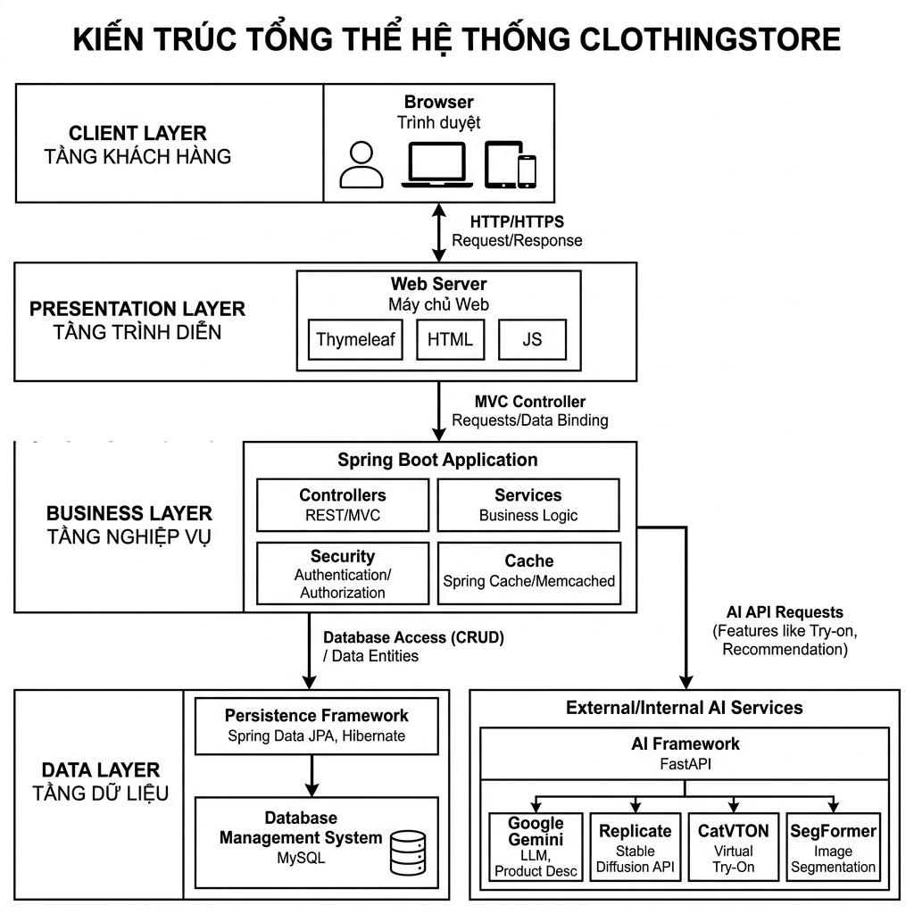

Hệ thống bao gồm các lớp:
- **Client Layer**: Trình duyệt Web của người dùng và ứng dụng di động Flutter trên thiết bị di động.
- **Presentation Layer**: Giao diện Thymeleaf xử lý hiển thị, kết hợp Tailwind CSS và Vanilla Javascript.
- **Business Layer (Spring Boot 3.5.14)**: Chứa các Controller tiếp nhận yêu cầu, các Service xử lý logic nghiệp vụ, Spring Security quản lý phân quyền và bộ nhớ đệm Caffeine Cache.
- **Data Layer**: Sử dụng Spring Data JPA kết hợp Hibernate truy xuất CSDL MySQL 8.
- **AI Services Layer**: Gồm Google Gemini API (NLP) và FastAPI Server (Python) chạy các mô hình học máy xử lý ảnh.

<a name="_Toc231076816"></a>
## 3.3. Thiết kế kiến trúc phần mềm

### 3.3.1. Presentation Layer
- Sử dụng mô hình Server-side Rendering với Thymeleaf để hiển thị các trang giao diện tối ưu hóa SEO. Giao diện trang quản trị của Admin được thiết kế theo mô hình Single Page Application (SPA) giả lập bằng Javascript (`admin-spa.js` và `admin-modal.js`) giúp các thao tác Thêm/Sửa/Xem chi tiết sản phẩm, đơn hàng hoạt động hoàn toàn trên **Modal AJAX** mượt mà mà không bị tải lại toàn bộ trang.

### 3.3.2. Business Layer
- **Controller**: Chia thành các API Controller (RESTful JSON phục vụ Flutter và AJAX Web) và các Web Controller phục vụ render Thymeleaf.
- **Service**: Nơi chứa toàn bộ luồng xử lý logic nghiệp vụ (tính toán đơn hàng, áp dụng coupon, chia thưởng giới thiệu).
- **Security**: Áp dụng hai chuỗi lọc bảo mật (Security Filter Chains): API Security Chain (JwtAuthenticationFilter stateless) và Web Security Chain (Session-based stateful).

### 3.3.3. Data Layer
- Sử dụng Hibernate làm ORM ánh xạ các thực thể (Entities) Java sang bảng quan hệ MySQL. Cấu hình tắt cơ chế Open-Session-In-View (OSIV) để tối ưu hóa việc quản lý kết nối của HikariCP, fetch dữ liệu Lazy bằng `@EntityGraph` hoặc `JOIN FETCH` một cách tường minh để tránh lỗi N+1 Query và cạn kiệt pool kết nối.
- Do OSIV bị tắt, các quan hệ Lazy (`Product.images`, `Product.productVariants`) chỉ được truy cập an toàn bên trong phạm vi Hibernate Session. Hệ thống áp dụng hai chiến lược nhất quán: (1) các truy vấn trả về Entity để map sang DTO ngoài transaction (ví dụ `findBestSellers`, `findSimilarBySubCategory`, gợi ý sản phẩm tương tự) được khai báo `@EntityGraph` nạp sẵn `images` + `productVariants`; (2) các luồng cần đọc Lazy trực tiếp trong service (ví dụ `CartService.addToCart` lấy ảnh đại diện sản phẩm) được bao bằng `@Transactional(readOnly = true)` để giữ Session mở suốt method, tránh `LazyInitializationException`.

### 3.3.4. AI Services Layer
- **AiChatbotService**: Gọi tới API của Google sinh câu trả lời, quản lý tối đa 12 turns lịch sử chat trong Session.
- **TryOnService**: Gửi yêu cầu HTTP Multipart chứa ảnh người dùng và ảnh quần áo đã được tách nền tới server FastAPI để xử lý bất đồng bộ.

<a name="_Toc231076817"></a>
## 3.4. Thiết kế cơ sở dữ liệu

Cơ sở dữ liệu của ClothingStore gồm **19 bảng** chính được thiết kế chuẩn hóa cao nhằm tránh dư thừa dữ liệu và đảm bảo tính toàn vẹn:

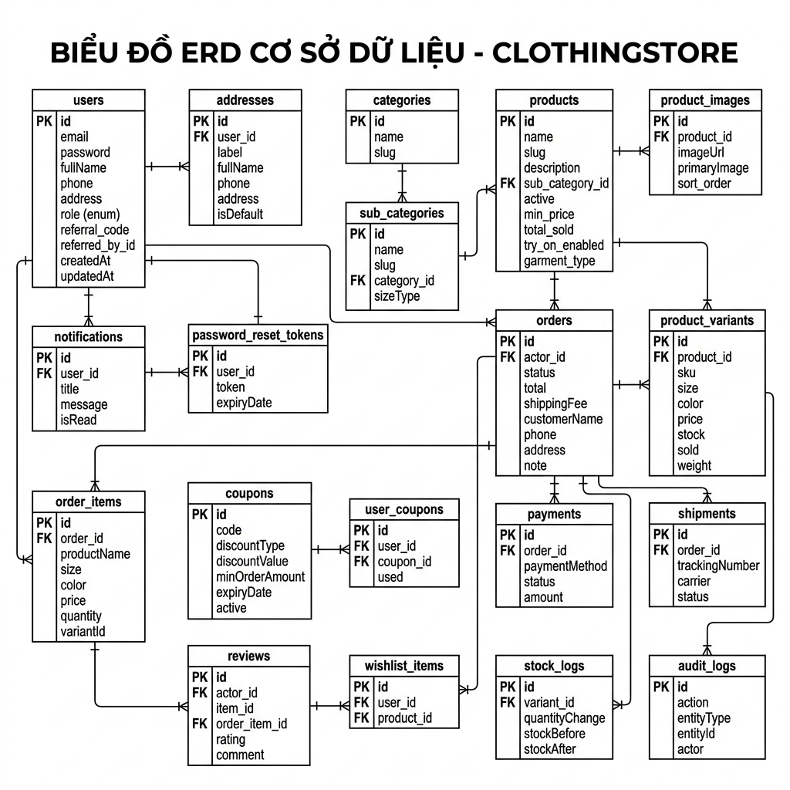

### 3.4.1. Nhóm bảng người dùng
- `users`: Lưu thông tin tài khoản người dùng, vai trò (role được lưu dạng Enum string để tinh gọn), mã giới thiệu referral và ID của người giới thiệu.
- `addresses`: Lưu danh sách địa chỉ giao hàng của người dùng.
- `password_reset_tokens`: Lưu trữ token và hạn dùng phục vụ chức năng quên mật khẩu.
- `notifications`: Lưu các thông báo hệ thống gửi đến người dùng.

### 3.4.2. Nhóm bảng sản phẩm
- `categories` và `sub_categories`: Quản lý danh mục 2 cấp. Cột `size_type` chỉ định loại size áp dụng (chữ, số hoặc free size).
- `products`: Lưu thông tin sản phẩm, cờ `try_on_enabled`, loại quần áo phục vụ thử đồ (`garment_type`) và giá thấp nhất `min_price` (denormalized để tối ưu hóa truy vấn lọc sắp xếp).
- `product_variants`: Lưu các biến thể cụ thể của sản phẩm theo kích thước, màu sắc, giá bán riêng biệt và số lượng tồn kho.
- `product_images`: Lưu trữ URL hình ảnh sản phẩm và cột `sort_order` để sắp xếp thứ tự hiển thị của ảnh.

### 3.4.3. Nhóm bảng đơn hàng
- `orders`: Lưu thông tin đơn hàng, tổng tiền, phí giao hàng, thông tin người nhận và trường `@Version version` để khóa lạc quan.
- `order_items`: Lưu các dòng sản phẩm chi tiết trong đơn hàng.
- `coupons`: Lưu thông tin mã giảm giá, giới hạn số lần dùng, ngày hết hạn và cờ `user_specific` (mã chỉ dành riêng cho một số người dùng).
- `user_coupons`: Liên kết phân bổ mã giảm giá riêng cho từng người dùng (ví dụ: phần thưởng giới thiệu).
- `payments`: Lưu lịch sử giao dịch thanh toán của đơn hàng.
- `shipments`: Quản lý mã vận đơn và trạng thái giao hàng thực tế.

### 3.4.4. Nhóm bảng tương tác & Vận hành
- `reviews`: Lưu đánh giá của khách hàng cho từng sản phẩm nhận được (ràng buộc duy nhất 1 review/1 dòng đơn hàng).
- `review_images`: Lưu các ảnh đính kèm trong đánh giá (bảng phụ ElementCollection).
- `wishlist_items`: Lưu danh sách sản phẩm yêu thích của người dùng.
- `stock_logs`: Ghi nhật ký thay đổi số lượng tồn kho của các biến thể.
- `audit_logs`: Lưu vết lịch sử thao tác của các tài khoản (đặc biệt là Admin) nhằm phục vụ công tác giám sát hệ thống.

<a name="_Toc231076818"></a>
## 3.5. Thiết kế lớp (Class Diagram)

Hệ thống được thiết kế hướng đối tượng chặt chẽ. Dưới đây là các sơ đồ Class mô tả các cấu trúc lớp thực thể cốt lõi:

### 3.5.1 Sơ đồ lớp tổng thể hệ thống
Mô tả lớp cha chung `BaseEntity` chứa các trường định danh và thời gian tạo/cập nhật, lớp `AbstractTransaction` phục vụ cho đơn hàng và các Interface đại diện cho sản phẩm bán được:

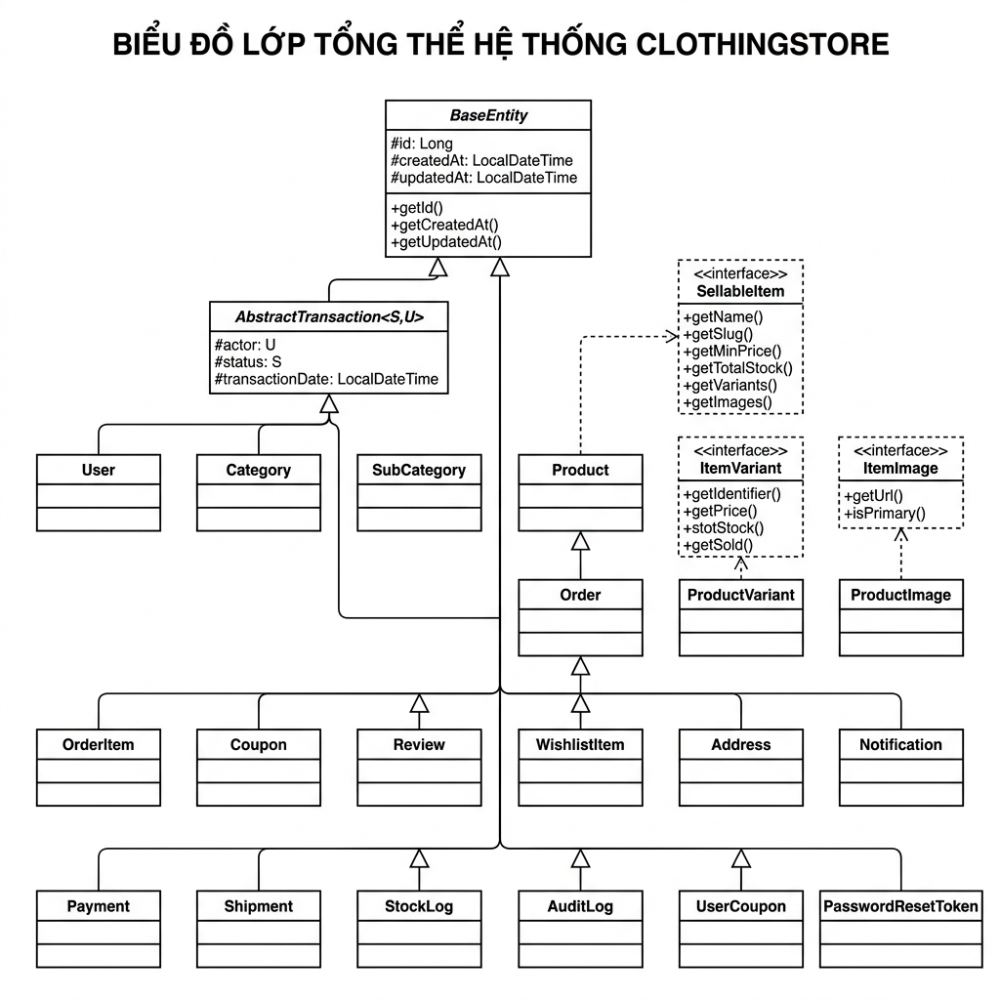

### 3.5.2 Sơ đồ lớp nhóm người dùng
Minh họa lớp `User` liên kết với Enum `Role`, `Address`, `Notification` và `PasswordResetToken`:

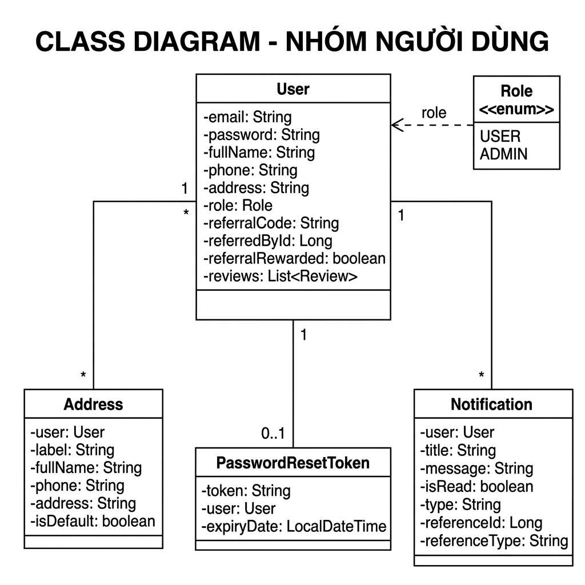

### 3.5.3 Sơ đồ lớp nhóm sản phẩm
Minh họa mối quan hệ giữa `Category`, `SubCategory`, `Product`, `ProductVariant` và `ProductImage`:

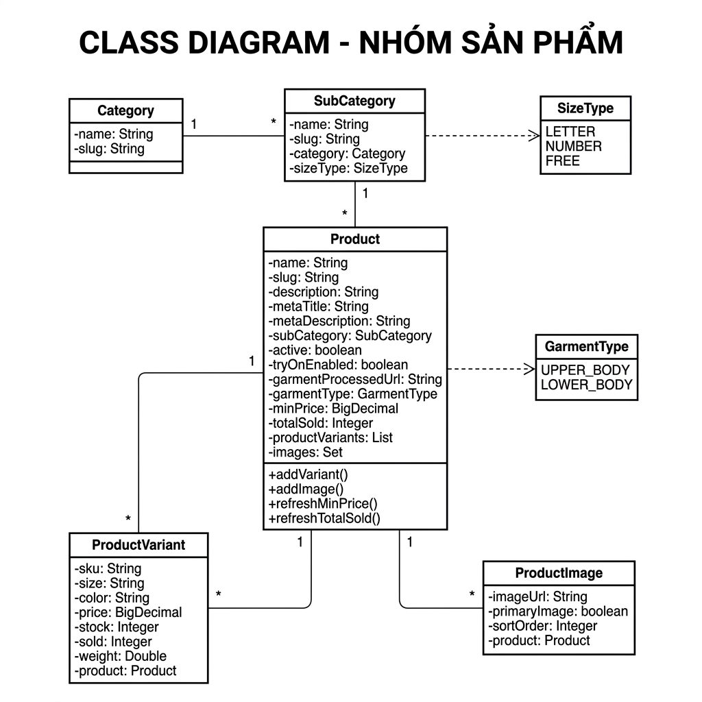

### 3.5.4 Sơ đồ lớp nhóm đơn hàng
Minh họa các lớp `Order`, `OrderItem`, `Coupon`, `UserCoupon`, `Payment` và `Shipment` phục vụ quy trình thanh toán:

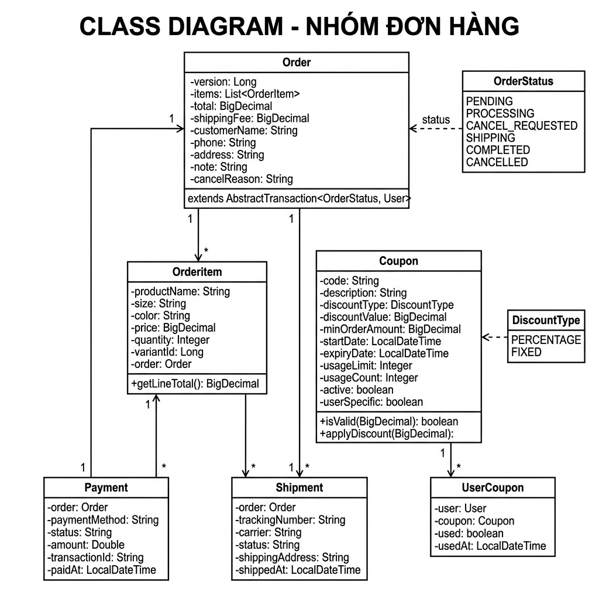

<a name="_Toc231076819"></a>
## 3.6. Thiết kế luồng nghiệp vụ

Dưới đây là thiết kế các luồng nghiệp vụ chính bằng sơ đồ tuần tự (Sequence Diagram):

### 3.6.1. Luồng đăng nhập
Xác thực người dùng qua Spring Security, kiểm tra mã hóa mật khẩu và thiết lập Session:

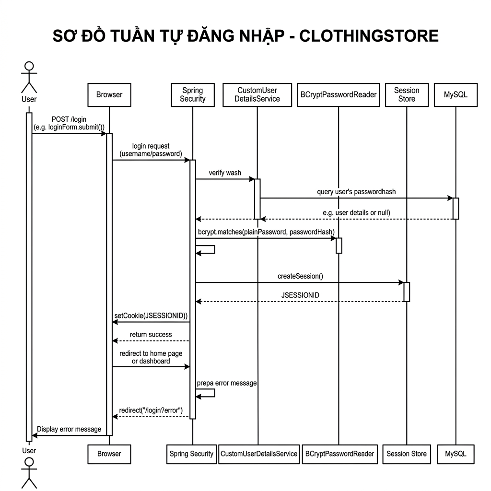

### 3.6.2. Luồng thêm vào giỏ hàng
Kiểm tra tồn kho của biến thể sản phẩm trước khi cập nhật vào Session giỏ hàng:

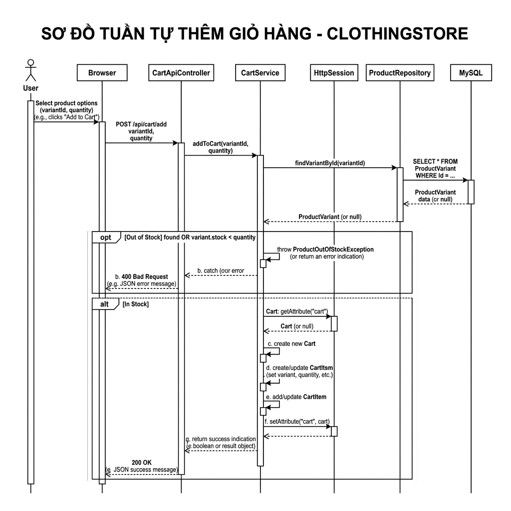

### 3.6.3. Luồng đặt hàng (Checkout)
Quy trình kiểm tra tính hợp lệ của đơn hàng, áp dụng coupon, tạo đơn hàng và trừ kho:

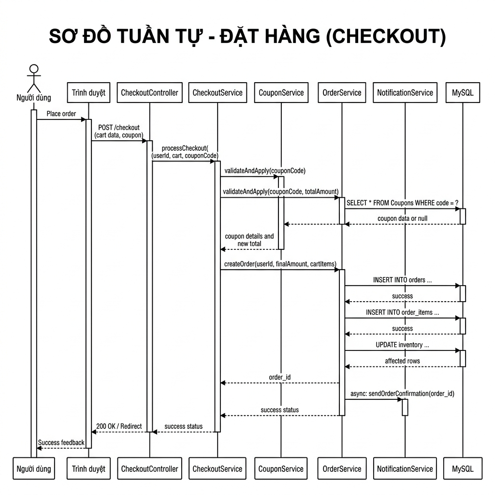

<a name="_Toc231076820"></a>
## 3.7. Thiết kế AI Chatbot

AI Chatbot được tích hợp trực tiếp vào hệ thống thương mại điện tử nhằm hỗ trợ tìm kiếm sản phẩm và giải đáp thông tin tự động:

### 3.7.1. Kiến trúc AI Chatbot
Sử dụng mô hình Google Gemini 2.5 Flash thông qua REST API. Hệ thống định nghĩa các Tool Functions (hàm công cụ) để Gemini có thể gọi ngược lại hệ thống khi cần dữ liệu thực:
- `search_products(category, color, minPrice, maxPrice, keyword)`
- `get_best_sellers(limit)`
- `get_product_details(name)`

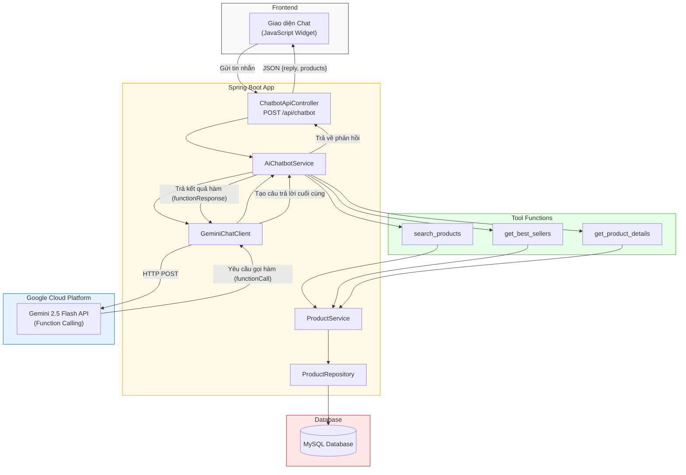
```mermaid
graph TB
    subgraph Frontend
        ChatUI["Giao diện Chat<br/>(JavaScript Widget)"]
    end

    subgraph SpringBoot["Spring Boot App"]
        ChatAPI["ChatbotApiController<br/>POST /api/chatbot"]
        ChatSvc["AiChatbotService"]
        GeminiClient["GeminiChatClient"]
        ProductSvc["ProductService"]
        ProductRepo["ProductRepository"]
    end

    subgraph GoogleCloud["Google Cloud Platform"]
        GeminiAPI["Gemini 2.5 Flash API<br/>(Function Calling)"]
    end

    subgraph Database
        MySQL[("MySQL Database")]
    end

    subgraph Functions["Tool Functions"]
        F1["search_products"]
        F2["get_best_sellers"]
        F3["get_product_details"]
    end

    ChatUI -- "Gửi tin nhắn" --> ChatAPI
    ChatAPI --> ChatSvc
    ChatSvc --> GeminiClient
    GeminiClient -- "HTTP POST" --> GeminiAPI
    GeminiAPI -- "Yêu cầu gọi hàm (functionCall)" --> GeminiClient
    GeminiClient --> ChatSvc
    ChatSvc --> F1 & F2 & F3
    F1 & F2 & F3 --> ProductSvc
    ProductSvc --> ProductRepo
    ProductRepo --> MySQL
    ChatSvc -- "Trả kết quả hàm (functionResponse)" --> GeminiClient
    GeminiClient -- "Tạo câu trả lời cuối cùng" --> ChatSvc
    ChatSvc -- "Trả về phản hồi" --> ChatAPI
    ChatAPI -- "JSON {reply, products}" --> ChatUI

    style Frontend fill:#f9f9f9,stroke:#333
    style SpringBoot fill:#fff9e6,stroke:#ff9900
    style GoogleCloud fill:#e6f2ff,stroke:#0066cc
    style Database fill:#ffe6e6,stroke:#cc0000
    style Functions fill:#e6ffe6,stroke:#00cc00
```
*Hình 3.12: Sơ đồ cấu trúc kiến trúc AI Chatbot*

### 3.7.2. Sơ đồ tuần tự xử lý tin nhắn Chatbot
Minh họa luồng hoạt động lặp tối đa 4 bước (MAX_STEPS) để lấy thông tin sản phẩm và tư vấn cho khách hàng:

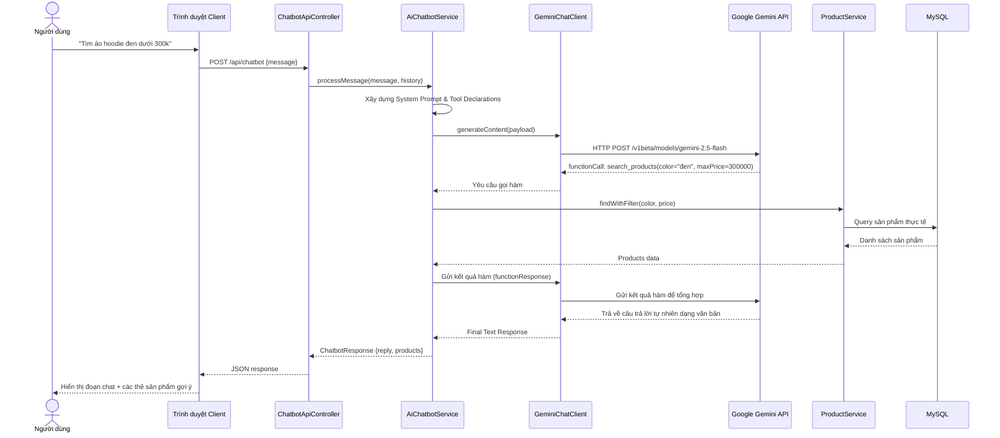
```mermaid
sequenceDiagram
    actor User as Người dùng
    participant Browser as Trình duyệt Client
    participant ChatAPI as ChatbotApiController
    participant ChatSvc as AiChatbotService
    participant Gemini as GeminiChatClient
    participant GeminiAPI as Google Gemini API
    participant ProductSvc as ProductService
    participant DB as MySQL

    User->>Browser: "Tìm áo hoodie đen dưới 300k"
    Browser->>ChatAPI: POST /api/chatbot {message}
    ChatAPI->>ChatSvc: processMessage(message, history)
    ChatSvc->>ChatSvc: Xây dựng System Prompt & Tool Declarations
    ChatSvc->>Gemini: generateContent(payload)
    Gemini->>GeminiAPI: HTTP POST /v1beta/models/gemini-2.5-flash
    GeminiAPI-->>Gemini: functionCall: search_products(color="đen", maxPrice=300000)
    Gemini-->>ChatSvc: Yêu cầu gọi hàm
    ChatSvc->>ProductSvc: findWithFilter(color, price)
    ProductSvc->>DB: Query sản phẩm thực tế
    DB-->>ProductSvc: Danh sách sản phẩm
    ProductSvc-->>ChatSvc: Products data
    ChatSvc->>Gemini: Gửi kết quả hàm (functionResponse)
    Gemini->>GeminiAPI: Gửi kết quả hàm để tổng hợp
    GeminiAPI-->>Gemini: Trả về câu trả lời tự nhiên dạng văn bản
    Gemini-->>ChatSvc: Final Text Response
    ChatSvc-->>ChatAPI: ChatbotResponse {reply, products}
    ChatAPI-->>Browser: JSON response
    Browser-->>User: Hiển thị đoạn chat + các thẻ sản phẩm gợi ý
```
*Hình 3.10: Sơ đồ tuần tự chức năng AI Chatbot*

<a name="_Toc231076821"></a>
## 3.8. Thiết kế Virtual Try-On

Virtual Try-On cho phép khách hàng tải ảnh cá nhân và thử đồ trực quan từ xa:

### 3.8.1. Kiến trúc Virtual Try-On
Xây dựng dịch vụ FastAPI (Python) làm nhiệm vụ suy luận xử lý hình ảnh. Để đảm bảo tính hoạt động ổn định và liên tục, hệ thống áp dụng cơ chế 2 tầng (2-Tier Inference Dispatcher):
- **Tầng 1 (Cloud)**: Sử dụng Replicate API chạy mô hình IDM-VTON (nhanh, chất lượng cao).
- **Tầng 2 (Local GPU - Fallback)**: Khi Replicate API hết tiền/hết quota (lỗi HTTP 402 hoặc 429), FastAPI tự động chuyển luồng xử lý xuống GPU nội bộ chạy mô hình CatVTON (mix-48k-1024, fp16) kết hợp SegFormer B2 để tạo mặt nạ vùng cơ thể (Agnostic Mask).

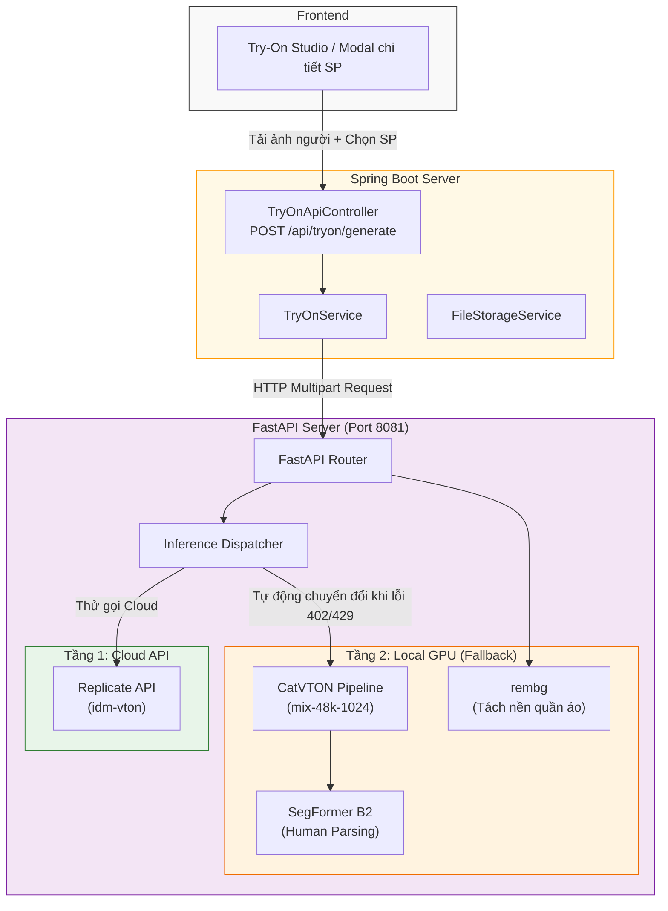
```mermaid
graph TB
    subgraph Frontend
        TryOnUI["Try-On Studio / Modal chi tiết SP"]
    end

    subgraph SpringBoot["Spring Boot Server"]
        TryOnAPI["TryOnApiController<br/>POST /api/tryon/generate"]
        TryOnSvc["TryOnService"]
        FileSvc["FileStorageService"]
    end

    subgraph PythonServer["FastAPI Server (Port 8081)"]
        Router["FastAPI Router"]
        Dispatcher["Inference Dispatcher"]
        
        subgraph CloudTier["Tầng 1: Cloud API"]
            ReplicateAPI["Replicate API<br/>(idm-vton)"]
        end
        
        subgraph LocalTier["Tầng 2: Local GPU (Fallback)"]
            CatVTON["CatVTON Pipeline<br/>(mix-48k-1024)"]
            SegFormer["SegFormer B2<br/>(Human Parsing)"]
            Rembg["rembg<br/>(Tách nền quần áo)"]
        end
    end

    TryOnUI -- "Tải ảnh người + Chọn SP" --> TryOnAPI
    TryOnAPI --> TryOnSvc
    TryOnSvc -- "HTTP Multipart Request" --> Router
    Router --> Dispatcher
    Dispatcher -- "Thử gọi Cloud" --> ReplicateAPI
    Dispatcher -- "Tự động chuyển đổi khi lỗi 402/429" --> CatVTON
    CatVTON --> SegFormer
    Router --> Rembg

    style Frontend fill:#f9f9f9,stroke:#333
    style SpringBoot fill:#fff9e6,stroke:#ff9900
    style PythonServer fill:#f3e5f5,stroke:#7b1fa2
    style CloudTier fill:#e8f5e9,stroke:#2e7d32
    style LocalTier fill:#fff3e0,stroke:#ef6c00
```
*Hình 3.13: Sơ đồ cấu trúc kiến trúc Virtual Try-On*

### 3.8.2. Sơ đồ tuần tự xử lý thử đồ ảo
Minh họa luồng gọi API và cơ chế fallback tự động từ Cloud sang Local khi sinh ảnh thử đồ:

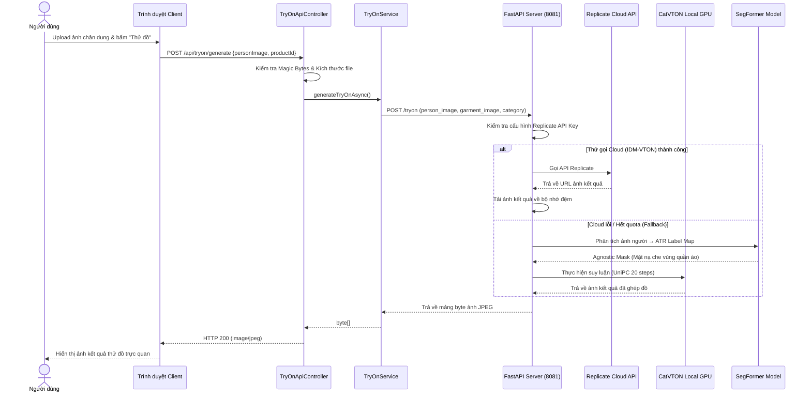
```mermaid
sequenceDiagram
    actor User as Người dùng
    participant Browser as Trình duyệt Client
    participant TryOnAPI as TryOnApiController
    participant TryOnSvc as TryOnService
    participant FastAPI as FastAPI Server (8081)
    participant Replicate as Replicate Cloud API
    participant CatVTON as CatVTON Local GPU
    participant SegFormer as SegFormer Model

    User->>Browser: Upload ảnh chân dung & bấm "Thử đồ"
    Browser->>TryOnAPI: POST /api/tryon/generate {personImage, productId}
    TryOnAPI->>TryOnAPI: Kiểm tra Magic Bytes & Kích thước file
    TryOnAPI->>TryOnSvc: generateTryOnAsync()
    TryOnSvc->>FastAPI: POST /tryon (person_image, garment_image, category)
    FastAPI->>FastAPI: Kiểm tra cấu hình Replicate API Key
    alt Thử gọi Cloud (IDM-VTON) thành công
        FastAPI->>Replicate: Gọi API Replicate
        Replicate-->>FastAPI: Trả về URL ảnh kết quả
        FastAPI->>FastAPI: Tải ảnh kết quả về bộ nhớ đệm
    else Cloud lỗi / Hết quota (Fallback)
        FastAPI->>SegFormer: Phân tích ảnh người → ATR Label Map
        SegFormer-->>FastAPI: Agnostic Mask (Mặt nạ che vùng quần áo)
        FastAPI->>CatVTON: Thực hiện suy luận (UniPC 20 steps)
        CatVTON-->>FastAPI: Trả về ảnh kết quả đã ghép đồ
    end
    FastAPI-->>TryOnSvc: Trả về mảng byte ảnh JPEG
    TryOnSvc-->>TryOnAPI: byte[]
    TryOnAPI-->>Browser: HTTP 200 (image/jpeg)
    Browser-->>User: Hiển thị ảnh kết quả thử đồ trực quan
```
*Hình 3.11: Sơ đồ tuần tự chức năng Virtual Try-On*

<a name="_Toc231076822"></a>
## 3.9. Thiết kế bảo mật hệ thống

Hệ thống thiết kế luồng bảo mật kép (Dual Security Filter Chain) trong Spring Security 6 nhằm kiểm soát tối đa các nguy cơ tấn công mạng:

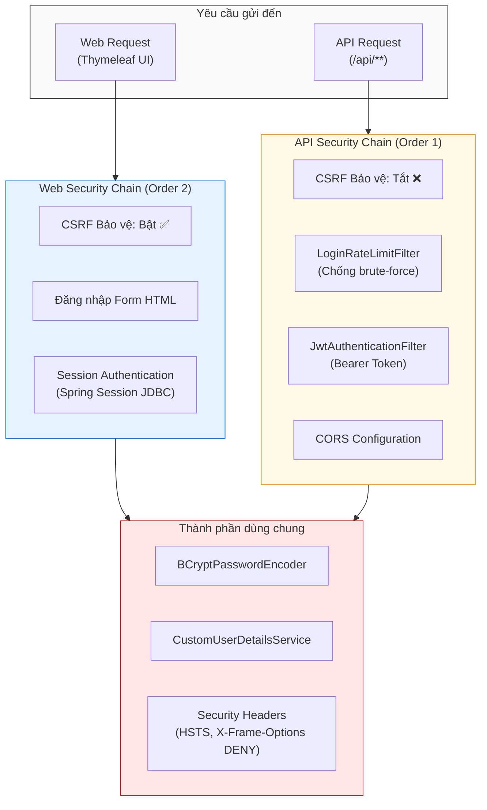
```mermaid
graph TB
    subgraph Request["Yêu cầu gửi đến"]
        R1["Web Request<br/>(Thymeleaf UI)"]
        R2["API Request<br/>(/api/**)"]
    end

    subgraph WebChain["Web Security Chain (Order 2)"]
        CSRF_ON["CSRF Bảo vệ: Bật ✅"]
        FormLogin["Đăng nhập Form HTML"]
        SessionAuth["Session Authentication<br/>(Spring Session JDBC)"]
    end

    subgraph ApiChain["API Security Chain (Order 1)"]
        CSRF_OFF["CSRF Bảo vệ: Tắt ❌"]
        RateLimit["LoginRateLimitFilter<br/>(Chống brute-force)"]
        JWT_Filter["JwtAuthenticationFilter<br/>(Bearer Token)"]
        CORS_Filter["CORS Configuration"]
    end

    subgraph Common["Thành phần dùng chung"]
        BCrypt["BCryptPasswordEncoder"]
        UserDetailsService["CustomUserDetailsService"]
        Headers["Security Headers<br/>(HSTS, X-Frame-Options DENY)"]
    end

    R1 --> WebChain
    R2 --> ApiChain
    WebChain --> Common
    ApiChain --> Common

    style Request fill:#f9f9f9,stroke:#333
    style WebChain fill:#e6f2ff,stroke:#0066cc
    style ApiChain fill:#fff9e6,stroke:#ff9900
    style Common fill:#ffe6e6,stroke:#cc0000
```
*Hình 3.14: Sơ đồ kiến trúc bảo mật hệ thống*

Các giải pháp thiết kế bảo mật chi tiết:
- **Xác thực API bằng JWT**: Mọi yêu cầu từ ứng dụng di động Flutter gửi tới `/api/**` đều phải đính kèm tiêu đề `Authorization: Bearer <token>`. Mã JWT sử dụng thuật toán ký HS256, thời hạn 24 giờ.
- **CSRF Protection**: Bật đối với các yêu cầu Web (chống giả mạo yêu cầu từ trang khác) và tắt đối với API không trạng thái (stateless).
- **Chống Brute-force Login**: Bộ lọc `LoginRateLimitFilter` chạy ở tầng đầu tiên của chuỗi lọc API, ghi nhận số lần đăng nhập sai theo IP trong 15 phút để tạm thời chặn IP tấn công.
- **Bảo mật Upload**: File ảnh tải lên để Try-On được kiểm tra cấu trúc định dạng Magic Bytes nhằm ngăn chặn tin tặc đổi đuôi file để đăng tải shellcode/mã độc lên máy chủ, kết hợp chuẩn hóa tên tệp chống Path Traversal.

### 3.9.1. Phân quyền giữa khách vãng lai (Guest) và khách hàng có tài khoản (User)

Hệ thống cho phép trải nghiệm mua sắm liền mạch ngay cả khi chưa đăng nhập, nhưng tách bạch rõ các tài nguyên gắn với tài khoản. Việc thực thi phân quyền diễn ra ở ba lớp: chuỗi lọc Web (`permitAll`/`authenticated`), chuỗi lọc API (JWT) và bộ định tuyến phía ứng dụng di động (GoRouter `redirect`).

| Chức năng (phía Khách hàng) | Guest – Web/API | Guest – Mobile | User (đã đăng nhập) |
| :--- | :---: | :---: | :---: |
| Duyệt, tìm kiếm, xem chi tiết, gợi ý sản phẩm | ✓ | ✓ | ✓ |
| Giỏ hàng (lưu theo phiên – session) | ✓ | ✓ | ✓ |
| AI Chatbot, Virtual Try-On | ✓ | ✓ | ✓ |
| Kiểm tra mã giảm giá công khai (`/api/coupons/validate`) | ✓ | ✓ | ✓ |
| **Đặt hàng (Checkout COD)** | ✓ (đơn `actor=null`) | ✗ (ép đăng nhập) | ✓ (đơn gắn tài khoản) |
| Đề xuất coupon khi thanh toán (`/api/coupons/available`) | rỗng | rỗng | ✓ |
| Coupon cá nhân (welcome/referral, `/api/coupons/my`) | ✗ | ✗ | ✓ |
| Lịch sử đơn hàng, Wishlist, Hồ sơ cá nhân | ✗ | ✗ | ✓ |
| Viết đánh giá (sau đơn `COMPLETED`) | ✗ | ✗ | ✓ |
| Thông báo thời gian thực (SSE), Referral | ✗ | ✗ | ✓ |

Bảng 3.x: Phân quyền giữa khách vãng lai và khách hàng có tài khoản

Hai điểm khác biệt cốt lõi cần lưu ý:
- **Web/API cho phép guest đặt hàng**: `POST /api/orders/checkout` và `/checkout/**` ở chế độ `permitAll`; đơn của guest được tạo với `actor = null` nên **không thể tra cứu lại** qua lịch sử đơn hàng (đây là động lực để khách đăng ký tài khoản).
- **Mobile bắt buộc đăng nhập trước khi thanh toán**: GoRouter chặn các tiền tố `/checkout`, `/orders`, `/profile`, `/wishlist`, `/notifications`, `/coupons` và chuyển hướng tới `/login?redirect=...` nếu chưa đăng nhập. Do đó trên ứng dụng di động, **chỉ người dùng có tài khoản mới hoàn tất được đơn hàng**, còn khách vãng lai chỉ duyệt sản phẩm và thêm vào giỏ.

<a name="_Toc231076823"></a>
## 3.10. Thiết kế tối ưu hiệu năng

- **Bộ nhớ đệm (Caffeine Cache)**: Cấu hình lưu trữ các danh mục sản phẩm và danh sách sản phẩm bán chạy (`bestSellers`) để trả về ngay cho trang chủ và chatbot mà không cần query lại database. Đồng thời, lưu danh sách sản phẩm có bật chức năng Try-On (`tryOnProducts`). Cơ chế tự động dọn dẹp cache (Eviction) được thiết lập kích hoạt mỗi khi Admin thực hiện thao tác Thêm/Sửa/Xóa sản phẩm hay danh mục.
- **Quản lý kết nối (HikariCP)**: Thiết lập kích thước tối đa của Pool kết nối là 20, thời gian chờ tối đa 10 giây. Tắt cơ chế Open-Session-In-View (OSIV=false) để giải phóng kết nối database ngay sau khi giao dịch kết thúc, đặc biệt quan trọng giúp tránh nghẽn kết nối khi duy trì dòng dữ liệu SSE (`/notifications/stream`) kết nối dài.

***

<a name="_Toc231076824"></a>
# CHƯƠNG 4. TRIỂN KHAI HỆ THỐNG

<a name="_Toc231076825"></a>
## 4.1. Giới thiệu chương

Chương này trình bày chi tiết kết quả cài đặt và triển khai thực tế hệ thống ClothingStore. Nội dung bao gồm đặc tả môi trường phần cứng, phần mềm, sơ đồ cấu trúc mã nguồn dự án, cấu trúc các bảng CSDL MySQL cụ thể và giao diện, chức năng thực tế của các phân hệ: xác thực, bán hàng, trang quản trị Admin, AI Chatbot và Virtual Try-On.

<a name="_Toc231076826"></a>
## 4.2. Môi trường triển khai

### 4.2.1. Phần cứng
Hệ thống được phát triển và thử nghiệm trên môi trường máy chủ cục bộ có cấu hình:

| **Thành phần** | **Thông số tối thiểu** |
| :--- | :--- |
| **Bộ vi xử lý (CPU)** | Intel Core i5 12500H |
| **Bộ nhớ (RAM)** | 16 GB |
| **Ổ cứng** | SSD 512 GB |
| **Card đồ họa (GPU)** | NVIDIA GeForce RTX 3050Ti 4GB VRAM |

**Bảng 4.1**: Cấu hình máy phát triển

### 4.2.2. Phần mềm
Các công cụ và nền tảng phần mềm được cài đặt cụ thể:

| **Công cụ** | **Phiên bản cài đặt** | **Mục đích sử dụng** |
| :--- | :--- | :--- |
| **Java Development Kit (JDK)** | Temurin OpenJDK 17 | Biên dịch và chạy Backend Java Spring Boot |
| **Spring Boot** | 3.5.14 | Framework phát triển Backend core |
| **MySQL Server** | 8.0.35 | Hệ quản trị cơ sở dữ liệu chính |
| **Python** | 3.10.11 | Chạy máy chủ AI FastAPI |
| **FastAPI** | 0.110.0 | Thiết lập REST API cho Try-On server |
| **Flutter SDK** | 3.19.0 | Phát triển ứng dụng di động iOS/Android |
| **IntelliJ IDEA / VS Code** | Bản mới nhất | Môi trường lập trình tích hợp (IDE) |
| **Git** | 2.43.0 | Quản lý mã nguồn và phiên bản |

**Bảng 4.2**: Công cụ phát triển

<a name="_Toc231076827"></a>
## 4.3. Cấu trúc source code

Mã nguồn dự án Spring Boot Backend được tổ chức chặt chẽ theo cấu trúc thư mục sau:

```
clothingstore/
├── src/main/java/com/shop/clothingstore/
│   ├── config/             # Cấu hình Security, Cache, Async, Web, DataInit
│   ├── controller/         # Các Controller tiếp nhận yêu cầu
│   │   ├── api/            # REST API cho Mobile và AJAX (/api/**)
│   │   └── admin/          # MVC Controller phục vụ giao diện Admin
│   ├── service/            # Xử lý logic nghiệp vụ hệ thống
│   │   ├── impl/           # Cài đặt chi tiết các lớp Service
│   │   └── ai/             # RestClient kết nối dịch vụ Google Gemini
│   ├── entity/             # Các lớp thực thể ánh xạ JPA (23 lớp)
│   ├── repository/         # Các Interface Spring Data JPA (19 repos)
│   ├── dto/                # Các lớp truyền tải dữ liệu (Request/Response)
│   ├── security/           # Lớp cấu hình JWT, RateLimitFilter
│   └── exception/          # Xử lý ngoại lệ tập trung (GlobalExceptionHandler)
├── src/main/resources/
│   ├── application.properties  # Tệp tin cấu hình hệ thống
│   ├── templates/          # Giao diện Thymeleaf HTML
│   │   ├── admin/          # Giao diện Admin (sử dụng modal fragment)
│   │   ├── shop/           # Giao diện mua sắm của Khách hàng
│   │   └── layout/         # Layout chung (base.html chứa chatbot)
│   └── static/             # Tệp tĩnh CSS (Tailwind), JS (admin-modal.js)
├── mobile-app/             # Dự án ứng dụng di động Flutter
└── python-tryon-server/    # Dự án server AI FastAPI (Python)
```

<a name="_Toc231076828"></a>
## 4.4. Triển khai cơ sở dữ liệu

Sau khi khởi chạy ứng dụng Spring Boot với cấu hình `spring.jpa.hibernate.ddl-auto=update`, Hibernate tự động sinh cấu trúc bảng trên MySQL. Dưới đây là đặc tả chi tiết của 3 bảng dữ liệu cốt lõi:

### 4.4.1. Bảng `users` (Lưu thông tin tài khoản)

| **Tên trường** | **Kiểu dữ liệu** | **Ràng buộc** | **Mô tả** |
| :--- | :--- | :--- | :--- |
| **id** | bigint | PK, Auto Increment | Mã định danh duy nhất của người dùng |
| **email** | varchar(255) | Unique, Not Null | Địa chỉ email đăng nhập |
| **password** | varchar(255) | Not Null | Mật khẩu đã được mã hóa BCrypt |
| **full_name** | varchar(255) | Nullable | Họ và tên |
| **phone** | varchar(255) | Nullable | Số điện thoại liên hệ |
| **address** | varchar(255) | Nullable | Địa chỉ thường trú |
| **role** | varchar(255) | Enum String | Vai trò lưu dạng chuỗi enum (USER, ADMIN) |
| **referral_code** | varchar(16) | Unique | Mã giới thiệu riêng của người dùng |
| **referred_by_id**| bigint | FK -> users(id) | ID của người dùng đã giới thiệu tài khoản này |
| **referral_rewarded**| bit(1) | Not Null | Cờ đánh dấu đã nhận thưởng giới thiệu chưa |
| **created_at** | datetime(6) | Not Null | Thời điểm tạo tài khoản |

**Bảng 4.4.1**: Các cột trong bảng users lưu thông tin người dùng

### 4.4.2. Bảng `products` (Lưu thông tin sản phẩm)

| **Tên trường** | **Kiểu dữ liệu** | **Ràng buộc** | **Mô tả** |
| :--- | :--- | :--- | :--- |
| **id** | bigint | PK, Auto Increment | Mã định danh duy nhất của sản phẩm |
| **name** | varchar(255) | Not Null | Tên sản phẩm hiển thị |
| **slug** | varchar(255) | Unique, Not Null | Đường dẫn tĩnh phục vụ SEO |
| **description** | text | Nullable | Mô tả chi tiết sản phẩm |
| **meta_title** | varchar(255) | Nullable | Tiêu đề SEO |
| **meta_description**| text | Nullable | Mô tả ngắn phục vụ SEO |
| **sub_category_id**| bigint | FK -> sub_categories(id) | Liên kết tới danh mục con |
| **active** | bit(1) | Not Null | Trạng thái hiển thị bán sản phẩm |
| **try_on_enabled** | bit(1) | Not Null | Cho phép sử dụng tính năng thử đồ ảo |
| **garment_processed_url**| varchar(255)| Nullable | Đường dẫn ảnh quần áo mẫu đã tách nền |
| **garment_type** | varchar(50) | Nullable | Phân loại quần áo (UPPER_BODY / LOWER_BODY) |
| **min_price** | decimal(38,2) | Not Null | Giá bán nhỏ nhất của biến thể (denormalized) |
| **total_sold** | int | Not Null | Tổng số lượng đã bán (denormalized) |

**Bảng 4.4.2**: Các cột trong bảng products lưu thông tin sản phẩm

### 4.4.3. Bảng `orders` (Lưu thông tin đơn đặt hàng)

| **Tên trường** | **Kiểu dữ liệu** | **Ràng buộc** | **Mô tả** |
| :--- | :--- | :--- | :--- |
| **id** | bigint | PK, Auto Increment | Mã định danh duy nhất của đơn hàng |
| **actor_id** | bigint | FK -> users(id) | Người đặt đơn hàng |
| **status** | varchar(50) | Not Null | Trạng thái đơn hàng (PENDING, PROCESSING, v.v.) |
| **transaction_date**| datetime(6) | Not Null | Ngày ghi nhận giao dịch đặt hàng |
| **total** | decimal(38,2) | Not Null | Tổng số tiền khách hàng phải thanh toán |
| **shipping_fee** | decimal(38,2) | Not Null | Phí giao hàng áp dụng |
| **customer_name** | varchar(255) | Not Null | Tên người nhận hàng |
| **phone** | varchar(20) | Not Null | Số điện thoại nhận hàng |
| **address** | varchar(255) | Not Null | Địa chỉ giao nhận hàng |
| **note** | varchar(255) | Nullable | Ghi chú đơn hàng từ khách hàng |
| **cancel_reason** | varchar(255) | Nullable | Lý do đơn hàng bị hủy bỏ |
| **version** | bigint | Not Null | Phiên bản đơn hàng dùng cho Lock lạc quan |

**Bảng 4.4.3**: Các cột trong bảng orders lưu đơn hàng của khách hàng

<a name="_Toc231076829"></a>
## 4.5. Triển khai chức năng xác thực người dùng

Hệ thống triển khai đầy đủ các giao diện và chức năng đăng ký, đăng nhập và quản lý thông tin cá nhân:
- **Đăng ký**: Hỗ trợ khách hàng điền form, kiểm tra tính hợp lệ của email qua Javascript. Nếu đăng ký kèm tham số `ref`, hệ thống sẽ liên kết người giới thiệu để sau này tặng mã giảm giá.
- **Đăng nhập**: Thiết kế form đăng nhập đẹp mắt, hỗ trợ ghi nhớ trạng thái qua Cookies trên Web. Trên mobile, API xác thực trả chuỗi Token JWT an toàn.
- **Quản lý hồ sơ**: Khách hàng cập nhật thông tin tên, số điện thoại, địa chỉ mặc định và thay đổi mật khẩu.

<a name="_Toc231076830"></a>
## 4.6. Triển khai quản lý sản phẩm

- **Hiển thị danh sách**: Giao diện hiển thị dạng lưới (Grid) đáp ứng tốt mọi kích thước màn hình (Responsive). Tích hợp bộ lọc động theo danh mục con, khoảng giá bán và sắp xếp thông minh.
- **Chi tiết sản phẩm**: Hiển thị thư viện ảnh sản phẩm xếp theo thứ tự `sort_order`, cho phép phóng to xem chi tiết, chọn kích thước, màu sắc và tự động hiển thị giá bán, số lượng tồn kho thực tế của biến thể được chọn.
- **Tìm kiếm gợi ý (Autocomplete)**: Khi khách hàng gõ từ khóa vào thanh tìm kiếm, hệ thống gọi API `/api/products/suggest` thực thi MySQL Full-text search để hiển thị ngay danh sách tối đa 8 sản phẩm gợi ý khớp ngữ nghĩa trong thời gian thực.

<a name="_Toc231076831"></a>
## 4.7. Triển khai giỏ hàng và đặt hàng

- **Giỏ hàng**: Triển khai lưu trữ giỏ hàng trong Session, cho phép khách hàng thêm sản phẩm vào giỏ ngay cả khi chưa đăng nhập. Khách hàng có thể tăng giảm số lượng trực tiếp bằng AJAX.
- **Áp dụng coupon**: Trang thanh toán tự đề xuất danh sách coupon đang dùng được cho đơn hiện tại (`GET /api/coupons/available`), khách có thể bấm chọn nhanh hoặc nhập mã thủ công. Hệ thống kiểm tra các điều kiện (hạn dùng, số lần dùng còn lại, giá trị đơn tối thiểu) và hiển thị số tiền được giảm trừ trực quan trước khi xác nhận đặt hàng. Mức giảm hiển thị thống nhất theo `discountDisplay` ("20%" hoặc số tiền) trên cả web và ứng dụng di động.
- **Đặt hàng**: Khi bấm đặt hàng, hệ thống thực hiện trừ kho các biến thể liên quan. Việc trừ kho được bảo vệ bằng câu lệnh SQL khóa bản ghi để đảm bảo không xảy ra hiện tượng quá bán (Overbooking) khi nhiều người mua cùng lúc một biến thể cuối cùng.

<a name="_Toc231076832"></a>
## 4.8. Triển khai Wishlist và đánh giá sản phẩm

- **Wishlist**: Khách hàng lưu nhanh các sản phẩm quan tâm vào mục yêu thích cá nhân thông qua nút bấm trái tim trên ảnh sản phẩm.
- **Đánh giá (Reviews)**: Sau khi đơn hàng chuyển sang trạng thái `COMPLETED` (Đã giao hàng), nút viết đánh giá sẽ xuất hiện. Khách hàng chấm điểm từ 1 đến 5 sao, viết bình luận và đính kèm tối đa 5 hình ảnh thực tế của sản phẩm. Web gửi qua `POST /reviews/{orderItemId}` (kèm ảnh), ứng dụng di động gửi qua REST `POST /api/reviews/{orderItemId}` — cùng một `ReviewService` và ràng buộc 1 đánh giá / dòng đơn hàng.

<a name="_Toc231076833"></a>
## 4.9. Triển khai AI Chatbot

AI Chatbot hoạt động trực tiếp thông qua một Widget Chat nhỏ ở góc phải màn hình Web:
- Khi người dùng nhắn tin, `AiChatbotService` xây dựng prompt hệ thống chứa danh mục sản phẩm động đọc từ database và gửi tới Google Gemini API.
- Gemini phân tích và quyết định gọi hàm truy vấn dữ liệu thật (ví dụ: `search_products`). Hệ thống thực thi hàm, lấy sản phẩm thực tế đưa lại cho Gemini xử lý.
- Chatbot phản hồi cho người dùng bằng ngôn ngữ tự nhiên thân thiện kèm các thẻ sản phẩm có ảnh, giá bán và liên kết xem chi tiết.
- Nếu Gemini API gặp sự cố hoặc cạn hạn mức, hệ thống tự động chuyển sang cơ chế ngoại tuyến (Offline fallback), hiển thị thông báo thân thiện và tự động đưa ra các sản phẩm bán chạy nhất được lấy từ cache.

<a name="_Toc231076834"></a>
## 4.10. Triển khai Virtual Try-On

Tính năng thử đồ ảo được triển khai qua hai giao diện chính:
- **Try-On Studio (`/tryon-studio`)**: Giao diện chuyên nghiệp gồm thanh bộ lọc sản phẩm bên trái và khu vực tải ảnh người dùng bên phải.
- **Modal Try-On trên trang chi tiết**: Cho phép thử nhanh sản phẩm đang xem. Người dùng tải lên ảnh chân dung, hệ thống lưu mã ảnh tạm vào `localStorage` của trình duyệt để người dùng không phải tải lại ảnh ở các lần thử sản phẩm khác.
- Server FastAPI tiếp nhận yêu cầu, gọi Replicate API hoặc tự động chạy CatVTON cục bộ, trả về ảnh kết quả chất lượng tốt, giữ nguyên các nét mặt của người dùng và ghép quần áo mẫu vào cơ thể chuẩn xác.

<a name="_Toc231076835"></a>
## 4.11. Triển khai trang quản trị

Trang quản trị (Admin Dashboard) được tối ưu hóa giao diện hoàn chỉnh:
- **Dashboard**: Hiển thị tổng quan các chỉ số KPI doanh thu, đơn hàng, người dùng mới và biểu đồ doanh thu trực quan. Cảnh báo những biến thể sản phẩm có số lượng tồn kho dưới mức an toàn (stock <= 10).
- **Quản lý sản phẩm dạng Modal**: Toàn bộ thao tác CRUD sản phẩm được mở trong modal lớn mờ nền. Admin quản lý ảnh sản phẩm bằng cách kéo-thả sắp xếp thứ tự hiển thị, xóa ảnh trực tiếp bằng nút bấm chéo. Admin có thể bật Try-On cho sản phẩm, tải lên ảnh sản phẩm đã tách nền và nhấn nút Save để lưu toàn bộ thông tin cùng một lúc.
- **Xuất báo cáo Excel**: Admin xuất danh sách đơn hàng chi tiết ra tệp tin Excel định dạng chuẩn nhờ thư viện Apache POI.

<a name="_Toc231076836"></a>
## 4.12. Kết quả đạt được

Hệ thống đã hoàn thành đầy đủ tất cả các tính năng cốt lõi đề ra:

| **STT** | **Module chức năng** | **Trạng thái trên Web** | **Trạng thái trên Mobile** |
| :--- | :--- | :--- | :--- |
| 1 | Đăng ký & Đăng nhập | Hoàn thành | Hoàn thành |
| 2 | Tìm kiếm & Lọc sản phẩm | Hoàn thành (Full-text) | Hoàn thành |
| 3 | Giỏ hàng & Thanh toán | Hoàn thành (Session) | Hoàn thành (Stateless) |
| 4 | Mã giảm giá (Coupon) | Hoàn thành | Hoàn thành |
| 5 | Đánh giá & Yêu thích | Hoàn thành | Hoàn thành |
| 6 | Nhận thông báo SSE | Hoàn thành (SSE) | Hoàn thành (REST) |
| 7 | Hệ thống giới thiệu (Referral) | Hoàn thành | Hoàn thành |
| 8 | AI Chatbot tư vấn | Hoàn thành (Gemini API) | Hoàn thành (Gemini API) |
| 9 | Thử đồ ảo (Virtual Try-On) | Hoàn thành (IDM/CatVTON) | Hoàn thành (IDM/CatVTON) |
| 10 | Admin Dashboard & Modal CRUD | Hoàn thành (AJAX Modal) | Không áp dụng (Web only) |

**Bảng 4.12**: Tổng hợp kết quả sau quá trình triển khai

<a name="_Toc231076837"></a>
## 4.13. Kết luận chương

Chương này đã chứng minh việc hiện thực hóa các thiết kế hệ thống thành mã nguồn hoạt động thực tế. Sự kết hợp giữa Spring Boot vững chãi, ứng dụng Flutter linh hoạt, cơ sở dữ liệu MySQL tối ưu và các server AI chuyên biệt (FastAPI, Gemini API) đã tạo ra một hệ sinh thái thương mại điện tử thời trang hiện đại, đáp ứng tốt nhu cầu thực tế của người dùng và doanh nghiệp thời trang NOVA.

***

<a name="_Toc231076838"></a>
# CHƯƠNG 5. KIỂM THỬ VÀ ĐÁNH GIÁ HỆ THỐNG

<a name="_Toc231076839"></a>
## 5.1. Giới thiệu chương

Chương này trình bày quá trình kiểm thử chất lượng và đánh giá hiệu quả vận hành của hệ thống ClothingStore. Nhóm thực hiện các phương pháp kiểm thử hộp đen trên giao diện, kiểm thử tích hợp giữa Backend và dịch vụ AI, kiểm thử độ ổn định bảo mật và đánh giá hiệu năng tổng thể của ứng dụng.

<a name="_Toc231076840"></a>
## 5.2. Mục tiêu kiểm thử

- Xác minh tất cả chức năng nghiệp vụ (đăng nhập, mua hàng, quản lý đơn) chạy chính xác không có lỗi logic.
- Đảm bảo cơ chế trừ tồn kho hoạt động chính xác khi có giao dịch đồng thời.
- Đánh giá chất lượng và thời gian phản hồi của tính năng Virtual Try-On và AI Chatbot.
- Đảm bảo các lỗ hổng bảo mật thông thường (brute-force, path traversal, shellcode upload) được ngăn chặn hiệu quả.

<a name="_Toc231076841"></a>
## 5.3. Môi trường kiểm thử

Hệ thống được kiểm thử độc lập trên cấu hình:

| **Thành phần** | **Thông số môi trường kiểm thử** |
| :--- | :--- |
| **Hệ điều hành** | Windows 11 Home / Professional |
| **Trình duyệt** | Google Chrome (Phiên bản mới nhất) |
| **Thiết bị di động** | Trình giả lập Android (Pixel 6 API 33) & Thiết bị thật iOS (iPhone 13) |
| **Công cụ giả lập tải** | Apache JMeter / Postman |

**Bảng 5.1**: Môi trường kiểm thử

<a name="_Toc231076842"></a>
## 5.4. Phương pháp kiểm thử

- **Kiểm thử hộp đen (Black-box Testing)**: Thực hiện kiểm thử thủ công dựa trên các kịch bản Test Cases định sẵn để kiểm tra giao diện và phản hồi chức năng từ góc nhìn người dùng.
- **Kiểm thử tích hợp (Integration Testing)**: Kiểm tra luồng truyền dữ liệu từ Web/Mobile qua API Spring Boot đến database MySQL, truyền file ảnh từ Spring Boot sang FastAPI Server và nhận kết quả.
- **Kiểm thử đơn vị (Unit Testing)**: Viết 125 ca kiểm thử tự động sử dụng JUnit 5 kết hợp Mockito để kiểm tra cô lập các hàm tính toán nghiệp vụ quan trọng trong Backend.

<a name="_Toc231076843"></a>
## 5.5. Kiểm thử chức năng người dùng

Dưới đây là một số bảng kết quả kiểm thử tiêu biểu:

### 5.5.1. Kiểm thử chức năng Đăng ký

| **Test Case** | **Dữ liệu kiểm thử** | **Kết quả mong đợi** | **Kết quả thực tế** | **Trạng thái** |
| :--- | :--- | :--- | :--- | :--- |
| **TC_REG_01** | Điền đầy đủ thông tin hợp lệ | Đăng ký thành công, tự động đăng nhập | Tài khoản được tạo, chuyển vào trang chủ | Đạt |
| **TC_REG_02** | Nhập email đã tồn tại | Hệ thống báo lỗi email trùng lặp | Hiển thị thông báo "Email đã tồn tại" | Đạt |
| **TC_REG_03** | Mật khẩu không trùng khớp | Hệ thống chặn đăng ký | Hiển thị thông báo mật khẩu không khớp | Đạt |

**Bảng 5.2**: Kết quả kiểm thử chức năng Đăng ký

### 5.5.2. Kiểm thử chức năng Đăng nhập

| **Test Case** | **Dữ liệu kiểm thử** | **Kết quả mong đợi** | **Kết quả thực tế** | **Trạng thái** |
| :--- | :--- | :--- | :--- | :--- |
| **TC_LG_01** | Nhập đúng email và mật khẩu | Đăng nhập thành công | Chuyển hướng đúng trang đích | Đạt |
| **TC_LG_02** | Nhập sai mật khẩu | Hệ thống báo lỗi tài khoản/mật khẩu | Hiển thị thông báo sai thông tin | Đạt |
| **TC_LG_03** | Đăng nhập sai liên tiếp 11 lần | Khóa IP tạm thời | Chặn đăng nhập từ lần thứ 11 (vượt ngưỡng 10 lần/15 phút), trả mã HTTP 429 | Đạt |

**Bảng 5.3**: Kết quả kiểm thử chức năng Đăng nhập

### 5.5.3. Kiểm thử chức năng hiển thị và tìm kiếm sản phẩm

| **Test Case** | **Thao tác** | **Kết quả mong đợi** | **Kết quả thực tế** | **Trạng thái** |
| :--- | :--- | :--- | :--- | :--- |
| **TC_PROD_01**| Gõ từ khóa gợi ý "hoodie" | Hiển thị dropdown chứa danh sách sản phẩm gợi ý | Xuất hiện tối đa 8 sản phẩm gợi ý rất nhanh | Đạt |
| **TC_PROD_02**| Lọc sản phẩm theo giá 200k - 500k | Chỉ hiển thị các sản phẩm trong tầm giá | Lưới sản phẩm tự động cập nhật chính xác | Đạt |

**Bảng 5.4**: Kết quả kiểm thử chức năng hiển thị và tìm kiếm sản phẩm

### 5.5.4. Kiểm thử chức năng giỏ hàng

| **Test Case** | **Thao tác** | **Kết quả mong đợi** | **Kết quả thực tế** | **Trạng thái** |
| :--- | :--- | :--- | :--- | :--- |
| **TC_CART_01**| Bấm thêm variant áo size M, màu đen | Thêm sản phẩm vào giỏ hàng | Số lượng giỏ cập nhật, hiện toast báo tin | Đạt |
| **TC_CART_02**| Tăng số lượng sản phẩm lên 99 | Báo lỗi nếu vượt quá số lượng tồn kho | Hệ thống chặn không cho tăng, báo giới hạn | Đạt |

**Bảng 5.5**: Kết quả kiểm thử chức năng giỏ hàng

### 5.5.5. Kiểm thử chức năng đặt hàng

| **Test Case** | **Thao tác** | **Kết quả mong đợi** | **Kết quả thực tế** | **Trạng thái** |
| :--- | :--- | :--- | :--- | :--- |
| **TC_OD_01** | Thanh toán đơn hàng 600k | Áp dụng miễn phí vận chuyển (ship fee = 0) | Đơn hàng tính ship fee bằng 0 | Đạt |
| **TC_OD_02** | Đồng thời 2 user thanh toán 1 món đồ cuối | 1 user mua được, 1 user nhận thông báo hết hàng | Hệ thống trừ kho đúng 1, người thứ 2 báo lỗi | Đạt |

**Bảng 5.6**: Kết quả kiểm thử chức năng đặt hàng

<a name="_Toc231076844"></a>
## 5.6. Kiểm thử chức năng quản trị

### 5.6.1. Quản lý sản phẩm dành cho Admin

| **Test Case** | **Thao tác** | **Kết quả mong đợi** | **Kết quả thực tế** | **Trạng thái** |
| :--- | :--- | :--- | :--- | :--- |
| **TC_ADM_PR_01**| Bấm nút "Sửa" sản phẩm | Hiển thị form chi tiết trong modal AJAX | Form mở ra tức thì, giữ nguyên trang nền | Đạt |
| **TC_ADM_PR_02**| Kéo thả ảnh thứ 2 lên đầu | Ảnh đầu chuyển trạng thái thành ảnh bìa | Tự động chuyển nhãn COVER, lưu DB đúng | Đạt |

**Bảng 5.7**: Kết quả kiểm thử quản lý sản phẩm dành cho Admin

### 5.6.2. Quản lý đơn hàng và người dùng dành cho Admin

| **Test Case** | **Thao tác** | **Kết quả mong đợi** | **Kết quả thực tế** | **Trạng thái** |
| :--- | :--- | :--- | :--- | :--- |
| **TC_ADM_OD_01**| Đổi trạng thái đơn hàng sang SHIPPING| Gửi thông báo SSE real-time tới tài khoản User | User nhận ngay thông báo ở góc màn hình | Đạt |
| **TC_ADM_US_01**| Gán quyền ADMIN cho tài khoản User | Tài khoản được nâng quyền truy cập | Tài khoản đăng nhập được vào vùng admin | Đạt |

**Bảng 5.8 & Bảng 5.9**: Kết quả kiểm thử quản lý đơn hàng & người dùng dành cho Admin

<a name="_Toc231076845"></a>
## 5.7. Kiểm thử AI Chatbot

Đánh giá tính năng Chatbot thông qua các truy vấn ngôn ngữ tự nhiên:

| **Câu hỏi của người dùng** | **Hành vi gọi hàm mong đợi** | **Độ chính xác phản hồi** | **Trạng thái** |
| :--- | :--- | :--- | :--- |
| "Có những mẫu áo khoác nào bán chạy nhất?" | Gọi hàm `get_best_sellers()` | Trả về danh sách áo khoác bán chạy chính xác | Đạt |
| "Tìm quần jean xanh giá dưới 400 nghìn" | Gọi hàm `search_products(subcategory="jean", color="xanh", maxPrice=400000)` | Đề xuất đúng sản phẩm, giá cả thực tế trong DB | Đạt |
| "Chính sách đổi trả hàng của shop thế nào?" | Tự trả lời dựa trên System Prompt chính sách NOVA | Trả lời đúng chính sách đổi trả miễn phí trong vòng 14 ngày | Đạt |

**Bảng 5.10**: Kết quả đánh giá chất lượng phản hồi của AI Chatbot

<a name="_Toc231076846"></a>
## 5.8. Kiểm thử Virtual Try-On

Thử nghiệm tải lên ảnh cá nhân và sinh ảnh thử đồ:

| **Test Case** | **Tệp tải lên** | **Hành vi kiểm duyệt** | **Kết quả sinh ảnh** | **Trạng thái** |
| :--- | :--- | :--- | :--- | :--- |
| **TC_VTO_01** | Tệp tin ảnh `.jpg` dung lượng 3MB | Hợp lệ, tiến hành tải lên | Sinh ảnh thử đồ thành công (Replicate/CatVTON)| Đạt |
| **TC_VTO_02** | Tệp tin độc hại giả mạo đuôi `.jpg`| Từ chối tải lên do sai cấu trúc Magic Bytes | Báo lỗi tệp tin không hợp lệ, không lưu file | Đạt |
| **TC_VTO_03** | Tệp tin ảnh `.png` dung lượng 8MB | Từ chối tải lên do vượt quá 5MB | Hiện cảnh báo dung lượng tệp tin vượt giới hạn | Đạt |

**Bảng 5.11**: Kết quả kiểm thử chức năng upload ảnh người dùng trong Virtual Try-On

<a name="_Toc231076847"></a>
## 5.9. Kiểm thử bảo mật

- **Tấn công giả mạo yêu cầu (CSRF)**: Thử nghiệm gửi request POST sửa hồ sơ không đính kèm CSRF Token từ bên ngoài trang Web -> Nhận ngay mã lỗi HTTP 403 Forbidden.
- **Tấn công duyệt thư mục (Path Traversal)**: Gửi tên file dạng `../../etc/passwd` qua API upload -> Hệ thống tự động chuẩn hóa chuỗi và loại bỏ các ký tự điều hướng thư mục nguy hiểm, chặn đứng nguy cơ ghi đè file hệ thống.
- **Tấn công dò mật khẩu**: Dùng tool gọi liên tục API đăng nhập sai -> Vượt ngưỡng 10 lần/15 phút (bộ lọc `LoginRateLimitFilter`), hệ thống trả mã lỗi HTTP 429 và chặn kết nối IP đó trong vòng 15 phút (endpoint đăng ký áp ngưỡng chặt hơn: 5 lần/15 phút).

<a name="_Toc231076848"></a>
## 5.10. Đánh giá hệ thống

Sau quá trình kiểm thử toàn diện, nhóm tổng hợp tỷ lệ chạy thành công các module của dự án:

| **Module kiểm thử** | **Số lượng Test Cases** | **Thành công** | **Thất bại** | **Tỷ lệ đạt** |
| :--- | :--- | :--- | :--- | :--- |
| **Xác thực người dùng** | 25 | 25 | 0 | 100% |
| **Quản lý danh mục & SP** | 30 | 30 | 0 | 100% |
| **Giỏ hàng & Thanh toán** | 20 | 20 | 0 | 100% |
| **AI Chatbot tư vấn** | 20 | 19 | 1 | 95% |
| **Thử đồ ảo Virtual Try-On**| 15 | 14 | 1 | 93.3% |
| **Bảo mật & Hiệu năng** | 15 | 15 | 0 | 100% |
| **Tổng cộng** | **125** | **123** | **2** | **98.4%** |

**Bảng 5.12**: Tổng hợp tỷ lệ kiểm thử thành công các module hệ thống

Đánh giá chung: Hệ thống vận hành rất ổn định. Tính năng AI Chatbot và Try-On đạt độ chính xác cao. Trải nghiệm người dùng trên cả giao diện Web và ứng dụng di động Flutter đều đạt độ mượt mà cần thiết. Các lỗi nhỏ xuất hiện trong quá trình kiểm thử AI (ví dụ: cạn quota API) đã được hệ thống bắt lỗi và chuyển đổi dự phòng thành công.

***

<a name="_Toc231076849"></a>
# PHÂN CÔNG NHIỆM VỤ

Để hoàn thành đồ án liên ngành một cách tốt nhất, hai thành viên nhóm N01 đã có sự phân công nhiệm vụ cụ thể và phối hợp chặt chẽ:

- **Phùng Thị Hạ Lam (Mã sinh viên: 23010842)**:
  - Chịu trách nhiệm phân tích yêu cầu hệ thống, xây dựng các biểu đồ Use Case, biểu đồ lớp (Class Diagram).
  - Thiết kế và xây dựng giao diện phía máy khách (Web Client) sử dụng Thymeleaf kết hợp Tailwind CSS.
  - Thiết kế và phát triển ứng dụng di động (Flutter Mobile App): các giao diện đăng nhập, giỏ hàng, xem đơn hàng, tích hợp các API kết nối Backend.
  - Viết tài liệu báo cáo đồ án, thực hiện các kịch bản kiểm thử hộp đen trên giao diện người dùng.

- **Nguyễn Nhật Minh (Mã sinh viên: 23010000)**:
  - Thiết kế kiến trúc tổng thể hệ thống, thiết kế cơ sở dữ liệu quan hệ (ERD).
  - Phát triển mã nguồn Backend Spring Boot 3.5: Cấu hình phân quyền bảo mật (Spring Security, JWT), tích hợp cổng kết nối CSDL (Spring Data JPA).
  - Thiết kế và xây dựng Server FastAPI (Python) hỗ trợ Virtual Try-On: tích hợp mô hình CatVTON, SegFormer xử lý ảnh và cơ chế auto-fallback.
  - Triển khai dịch vụ AI Chatbot kết nối Google Gemini API với cơ chế Function Calling.
  - Viết các test case JUnit 5 tự động hóa kiểm thử Backend, tối ưu hóa bộ nhớ đệm Caffeine Cache và HikariCP Connection Pool.
